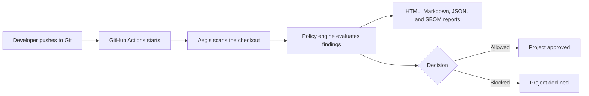
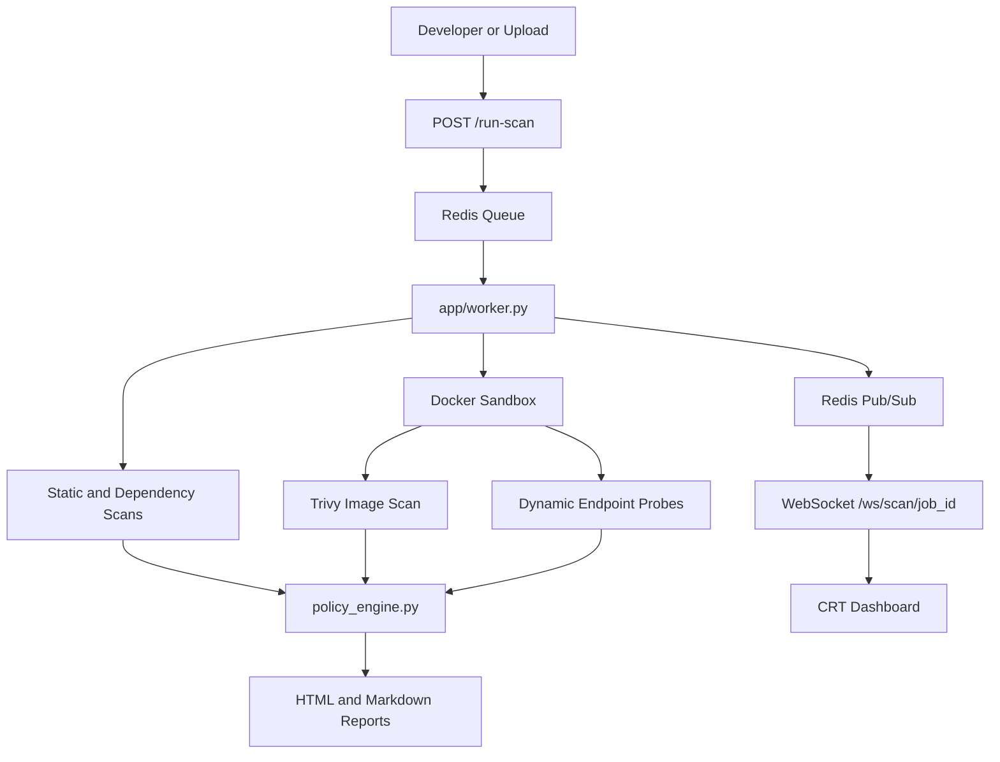

# Aegis: DevSecOps Security Console and CLI Scanner

Aegis is a Python security scanner and retro CRT-style DevSecOps dashboard. It can be used as a terminal gate with `aegis scan <filename>` or as a FastAPI web console with Redis Queue workers, WebSocket log streaming, WAF controls, Docker sandbox execution, and generated HTML/Markdown security reports.

The current scanner stack focuses on Python source, dependency risk, secrets, suspicious payload signatures, container image checks, and dynamic endpoint probes when Docker is available.

---

## Quick CLI Use

After installing or linking the package, scan a file with:

```bash
aegis scan app/main.py
```

Scan a directory:

```bash
aegis scan .
```

Skip Docker, Trivy, and DAST checks for a faster local-only scan:

```bash
aegis scan app/main.py --no-docker
```

Set a per-tool timeout:

```bash
aegis scan . --timeout 60
```

Write reports to a specific directory:

```bash
aegis scan app/main.py --output ./aegis-reports
```

Print a JSON summary for CI or scripts:

```bash
aegis scan app/main.py --no-docker --json
```

Suppress progress output:

```bash
aegis scan app/main.py --quiet
```

Override blocking severities for supported scanner families:

```bash
aegis scan . --fail-on high,critical
```

The CLI writes reports next to the target:

```txt
.aegis/scans/report.html
.aegis/scans/report.md
```

Exit codes:

```txt
0 = deployment allowed
1 = security gate blocked or command failed
```

---

## Local Development Commands

Run the CLI from the source checkout:

```bash
./bin/aegis scan app/main.py
```

Expose the short `aegis` command locally through npm:

```bash
npm link
aegis scan app/main.py
```

Or install shell aliases:

```bash
./scripts/setup_alias.sh
source ~/.zshrc
aegis scan app/main.py
```

Start the web console:

```bash
chmod +x setup.sh
./setup.sh
```

Open:

```txt
http://127.0.0.1:5001
```

---

## Package Installation

Install from the GitHub package source:

```bash
npm install -g github:huslenine999/aegis
aegis scan app/main.py
```

The package exposes the command:

```txt
aegis
```

The public npm name `aegis` is already taken by another package. If that registry name becomes available or transferred, the install command can become `npm install -g aegis`. Homebrew formula support is also present in `Formula/` for local tap-based installation.

---

## Health and Version Checks

Check local scanner dependencies:

```bash
aegis doctor
aegis doctor --json
```

Print the package version:

```bash
aegis version
```

---

## Cloud Approval Gate

Aegis can run as the approval gate after developers push code to GitHub:



This repository wires that flow in `.github/workflows/security-pipeline.yml`. The `security-gate` job uses the local GitHub Action and runs:

```bash
aegis scan . --no-docker --output aegis-reports --json --fail-on medium,high,critical
```

When Aegis returns exit code `0`, the project is approved and downstream jobs can continue. When it returns exit code `1`, the project is declined, the workflow fails, and the generated report explains which scanner blocked the project.

Generated cloud reports are available in the GitHub Actions run summary and in the `aegis-approval-reports` artifact.

To use Aegis from another GitHub repository:

```yaml
name: Aegis Security Gate

on:
  push:
    branches: ["main"]
  pull_request:
    branches: ["main"]

jobs:
  security-gate:
    runs-on: ubuntu-latest
    steps:
      - uses: actions/checkout@v4
      - uses: huslenine999/aegis@main
        with:
          scan-target: .
          output-dir: aegis-reports
          no-docker: "true"
          fail-on: medium,high,critical
```

---

## Scanner Coverage

Aegis coordinates these scanner paths:

1. Ruff SAST checks using the Bandit-compatible `S` rule family.
2. Semgrep custom Python rules for SQL injection, command execution, unsafe eval, pickle, and weak hashes.
3. Safety and OSV dependency analysis for `requirements.txt`.
4. CVSS v3.1 parsing and exploitability scoring.
5. detect-secrets scanning for hardcoded credentials.
6. YARA or fallback signature scans for webshell and suspicious execution patterns.
7. ClamAV or fallback malware signature checks.
8. Docker sandbox execution with memory, CPU, and PID limits.
9. Trivy image scanning when Docker and Trivy are available.
10. DAST-style endpoint probes against active sandbox containers.
11. WAF-aware risk reduction in the web console flow.

The CLI initializes placeholder reports for skipped tools so policy decisions stay deterministic. Docker-dependent checks are skipped cleanly when Docker is disabled or unavailable.

Shared scanner implementations for Semgrep rule generation, YARA fallback matching, and ClamAV fallback matching live in `app/scanners.py`. The CLI and web worker call that shared module with different log adapters, so report shapes stay consistent across terminal and dashboard scans.

When Docker scanning is enabled, the CLI builds a temporary sandbox image, starts the container with memory, CPU, PID, and `WAF_ENABLED` controls, waits for the actual localhost sandbox URL to become healthy, then runs Trivy and DAST probes against that URL.

---

## Web Console Architecture



The dashboard supports Simple and Tactical views, live scan state updates, EventSource telemetry, WAF rule controls, dependency graph visualization, and generated compliance reports.

---

## Project Structure

```txt
aegis/
├── app/
│   ├── cli.py                  # CLI scanner entrypoint for aegis scan
│   ├── main.py                 # FastAPI app, WAF middleware, routes, WebSockets
│   ├── worker.py               # Redis Queue worker for async scans
│   ├── secure_main.py          # Hardened demo target
│   ├── database.py             # SQLite setup and WAF rule seed data
│   ├── sandbox.py              # Docker sandbox lifecycle and telemetry
│   ├── scanners.py             # Shared Semgrep, YARA, and ClamAV scanner helpers
│   └── templates/
│       ├── index.html          # CRT dashboard UI
│       └── report_template.html
├── bin/
│   ├── aegis                   # Local shell wrapper
│   └── cli.js                  # npm executable wrapper
├── rules/
│   └── semgrep_rules.yaml
├── scripts/
│   ├── seed_db.py
│   └── setup_alias.sh
├── scans/                      # Web-console scan output
├── tests/
│   ├── test_cli.py
│   ├── test_policy.py
│   ├── test_upload_scan.py
│   └── ...
├── policy_engine.py
├── package.json
├── requirements.txt
└── setup.sh
```

---

## Testing

Focused scanner, CLI, sandbox, and policy-adjacent verification:

```bash
./venv/bin/python -m pytest tests/test_cli.py tests/test_sandbox.py tests/test_phase1.py tests/test_phase3.py::test_run_clamav_scan_eicar tests/test_phase3.py::test_run_clamav_scan_backdoor
```

Syntax and help checks:

```bash
./venv/bin/python -m py_compile app/scanners.py app/cli.py app/worker.py
./venv/bin/python app/cli.py --help
./venv/bin/python app/cli.py scan --help
./venv/bin/python app/cli.py doctor --json
./venv/bin/python app/cli.py version
```

Current focused verification status:

```txt
29 passed, 96 warnings
```

The full suite currently collects 64 tests. A broader phase3 run was interrupted after 29 passing tests because a later WAF/DAST integration path hung, so the next QA task is to isolate that slow test before marking the complete suite green.

The GitHub Actions workflow in `.github/workflows/security-pipeline.yml` runs both the cloud approval gate and the focused CLI/policy validation path on pushes and pull requests.

---

## Git Hook

Install Aegis as a pre-push gate in the current Git repo:

```bash
aegis install-hook
```

Remove it:

```bash
aegis uninstall-hook
```

The hook runs:

```bash
aegis scan "$REPO_DIR"
```

and blocks the push when the policy engine returns a non-zero exit code.

---

## Notes for Teams

- Use `aegis scan <filename>` for quick local review before committing.
- Use `aegis scan . --no-docker` in fast pre-push or CI jobs when Docker is unavailable.
- Use `aegis scan . --json --output ./reports` when integrating with automation.
- Run the full dashboard flow when you want live logs, WAF controls, sandbox telemetry, and visual reports.
- Treat generated `.aegis/scans/` output as local scan artifacts unless you explicitly want to archive reports.
