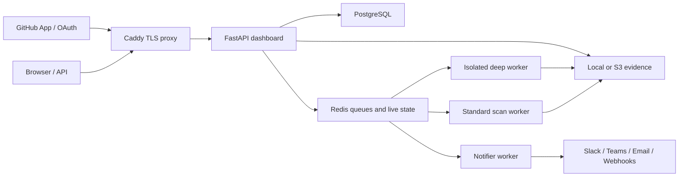

# Aegis

Private, explainable security gates for small engineering teams.

Aegis scans source code, dependencies, secrets, containers, and running test
targets; turns the results into an allow, block, or operational-error decision;
and keeps the evidence in a self-hosted project workspace.

Use it as:

- a local command-line scanner;
- a pull-request security gate;
- or a self-hosted workbench for findings, policy, evidence, and remediation.

> [!IMPORTANT]
> Aegis is ready for local evaluation and controlled single-customer pilots.
> Production deployment still requires an operator to provision secrets,
> backups, monitoring, and—if Deep scans are enabled—an isolated Docker-capable
> worker. This release is not presented as a public shared multi-tenant service.

## Why Aegis?

Many small teams want a dependable release-security check without sending
private source code to another hosted platform or assembling five unrelated
scanner reports by hand.

Aegis provides one workflow:

1. scan an approved repository;
2. evaluate it against an explicit policy version;
3. explain why the release passed, was blocked, or could not be evaluated;
4. track findings until they are fixed or formally accepted;
5. export signed evidence that can be verified independently.

## Choose your path

| Goal | Start here | Requirements |
| --- | --- | --- |
| Try the scanner | [CLI evaluation](#cli-evaluation) | Python 3.11+ |
| Run the complete workbench locally | [Local workbench](#local-workbench) | Source checkout, Docker, Compose v2 |
| Gate a repository in CI | [GitHub Action](#github-action) | A GitHub workflow |
| Operate an internal pilot | [Production pilot](#production-pilot) | DNS, TLS, PostgreSQL, Redis, workers, backups |

## CLI evaluation

Install a published Aegis release in an isolated environment:

```bash
pipx install aegis-security-console
```

For Standard scans with Semgrep included, install the scanner extra:

```bash
pipx install "aegis-security-console[scanner]"
```

If PyPI reports that no matching distribution exists before the first tagged
release is published, install the current repository revision instead:

```bash
pipx install "git+https://github.com/huslenine999/aegis.git#egg=aegis-security-console[scanner]"
```

Check the available scanner dependencies, then run the built-in demonstration:

```bash
aegis doctor
aegis demo --open
```

The demo creates a tiny intentionally vulnerable application. A blocked verdict
is expected.

Scan your own repository:

```bash
cd your-project
aegis scan . --fast
```

For a release or CI gate, use strict mode so missing scanner evidence is never
treated as a clean result:

```bash
aegis scan . \
  --strict \
  --fail-on medium,high,critical \
  --output .aegis/reports \
  --sarif .aegis/reports/aegis.sarif
```

Exit codes are stable and intended for automation:

| Code | Decision |
| ---: | --- |
| `0` | Allowed by policy |
| `1` | Blocked by security findings |
| `2` | Scanner, configuration, or operational failure |

Other useful commands:

```bash
aegis scan . --no-docker        # Skip Docker, Trivy, and DAST
aegis scan . --json --quiet     # Machine-readable result
aegis report --open             # Open the latest HTML report
aegis install-hook              # Add a Git pre-push gate
aegis verify-evidence ./scan-manifest.json --public-key YOUR_PINNED_KEY
```

## Local workbench

The full workbench is started from a source checkout because the scanner-only
Python package does not include the Compose topology and deployment
configuration.

```bash
git clone https://github.com/huslenine999/aegis.git
cd aegis

python3 -m venv venv
./venv/bin/python -m pip install -e ".[dev,scanner]"
./venv/bin/aegis start
```

`aegis start` checks Docker and local ports, generates owner-only development
secrets in `.env.aegis`, starts the stack, waits for readiness, and opens the
one-time setup wizard at [http://localhost](http://localhost).

To leave the browser closed or inspect startup directly:

```bash
./venv/bin/aegis start --no-open
./venv/bin/aegis logs --follow
```

After signing in:

1. open **Projects**;
2. create a local project or connect GitHub and import a repository;
3. choose Quick or Standard scanning;
4. review the policy decision and durable findings;
5. assign owners, acknowledge or resolve findings, and create GitHub remediation
   issues;
6. download the report bundle and signed evidence manifest.

Stop the stack without deleting its data:

```bash
./venv/bin/aegis stop
```

## What the workbench adds

The web application turns one-off scanner output into an operational workflow:

- project workspaces with viewer, operator, and administrator roles;
- immutable policy versions bound to individual scans;
- durable finding fingerprints, occurrences, owners, due dates, and event history;
- expiring accepted-risk and false-positive decisions with required rationale;
- GitHub repository import, pull-request checks, and remediation issues;
- cancellable Redis/RQ jobs with authenticated live progress;
- HTML, Markdown, JSON, SARIF, CycloneDX SBOM, and ZIP evidence exports;
- Ed25519-signed manifests and SHA-256 artifact integrity checks;
- Slack, Teams Workflow, email, and signed webhook notifications;
- local authentication with TOTP MFA, plus optional enterprise OIDC;
- append-only audit-chain verification, metrics, diagnostics, and API tokens;
- local or S3-compatible artifact storage with optional KMS and object lock.

## Scan presets

| Preset | Intended use | Runtime expectation |
| --- | --- | --- |
| **Quick** | Developer feedback | Fast local checks; expensive and external scanners are skipped |
| **Standard** | Pull requests and branch gates | Static analysis, dependencies, secrets, and signature checks |
| **Deep** | Controlled release audit | Standard checks plus sandbox execution, DAST, and container analysis |

Deep scans are deliberately not enabled by the default local topology. They are
sent to a dedicated queue and require a worker that advertises the isolated
capability and has access to a reviewed Docker runtime and Trivy. Provision that
worker on infrastructure intended for hostile source code; do not mount a
production host Docker socket into the dashboard.

## Scanner coverage

| Area | Implementation |
| --- | --- |
| Python security analysis | Ruff security rules |
| Pattern analysis | Semgrep and Aegis rules |
| Dependency vulnerabilities | OSV; optional licensed Safety integration |
| Secrets | detect-secrets |
| Malware and signatures | YARA and ClamAV-compatible checks |
| Containers and filesystems | Trivy when the approved Docker runtime is available |
| Dynamic behavior | Isolated sandbox and Aegis DAST probes |
| Correlation and gating | Versioned severity policy and audited suppressions |

Requested scanner failures are recorded as operational failures. Use strict mode
for any release decision.

## Project configuration

Aegis discovers `aegis.yml`, `aegis.yaml`, `.aegis.yml`, or `.aegis.yaml` from
the scan target upward. Command-line options override file configuration.

```yaml
scan:
  no_docker: true
  fail_on: medium,high,critical
  timeout: 120
  sarif: .aegis/reports/aegis.sarif
  exclude_paths:
    - tests/fixtures
  suppressions:
    - tool: Ruff
      rule: S103
      path: app/cli.py
      reason: Required executable permission for the generated Git hook.
      approved_by: application-security
      ticket: SEC-123
      expires_at: 2027-07-20
```

A suppression is active only when it includes a meaningful reason, approver,
tracking ticket, and future ISO-8601 expiry. Applied, invalid, and expired
exceptions are written to `suppressions-report.json`; malformed exceptions never
hide findings.

## GitHub Action

Use the repository Action as a fail-closed pull-request gate:

```yaml
name: security

on:
  pull_request:

jobs:
  aegis:
    runs-on: ubuntu-latest
    steps:
      - uses: actions/checkout@<reviewed-commit-sha>
      - name: Aegis security gate
        uses: huslenine999/aegis@<reviewed-commit-sha>
        with:
          scan-target: .
          no-docker: "true"
          fail-on: medium,high,critical
```

Pin Aegis and every third-party Action to reviewed immutable commit SHAs in a
protected production workflow.

For repository import, exact-head pull-request checks, and remediation tickets,
follow the [GitHub integration guide](docs/GITHUB.md).

## Production pilot

The supported production shape is one isolated Aegis deployment per customer or
trust boundary.

Start with the environment template:

```bash
cp .env.production.example .env
```

Replace every placeholder, point `AEGIS_DOMAIN` at the host, and validate the
configuration before exposing the service:

```bash
docker compose config
docker compose up --build -d

curl https://aegis.example.com/health
curl https://aegis.example.com/ready
```

Production mode fails closed when required authentication, PostgreSQL, Redis,
workers, notifier, host/origin allowlists, or secrets are missing.

Before giving a team access, complete all of the following:

- run a real backup and restore rehearsal;
- run `scripts/pilot_readiness.py` and a canary repository scan;
- configure metrics, logs, queue-age alerts, and notification failure alerts;
- pin and escrow the evidence-signing and encryption keys;
- verify GitHub permissions using known safe and vulnerable pull requests;
- configure S3/KMS/object lock if local artifact storage is not acceptable;
- configure and test OIDC and a break-glass administrator procedure if required;
- provision an isolated deep worker before enabling `AEGIS_ALLOW_DEEP_SCANS`.

S3 and OIDC adapters are included, but Aegis does not provision the provider,
bucket, KMS policy, DNS, TLS, Docker isolation, or disaster-recovery environment
for you. Those controls must be configured and reviewed in the deployment where
Aegis runs.

See the [production guide](docs/PRODUCTION.md), [operations and recovery
runbook](docs/OPERATIONS.md), and [controlled pilot runbook](docs/PILOT_RUNBOOK.md).

## Architecture



The dashboard authorizes users and projects. Scanner workers process untrusted
source. The notifier owns outbound notification credentials. PostgreSQL stores
identity, project, policy, finding, audit, and scan metadata. Redis contains
bounded transient job state rather than authoritative evidence.

## Security model

Important controls include:

- project-scoped RBAC and tenant consistency guards;
- revocable server-side sessions, CSRF checks, login lockout, and TOTP MFA;
- OIDC authorization code flow with PKCE, state, nonce, issuer, audience, and
  signing-key validation;
- encrypted GitHub and notification credentials;
- replay-resistant GitHub webhooks and exact-head check runs;
- request limits, scanner deadlines, workspace limits, and fail-closed evidence;
- signed manifests, artifact hashes, and append-only audit-chain verification;
- a separate notifier process that does not expose SMTP credentials to scanners;
- production host and CORS allowlists with no wildcard defaults.

Aegis still executes security tooling against untrusted source. Treat worker
compromise as a realistic threat, keep production credentials out of workers,
and review the [threat model](docs/THREAT_MODEL.md) before deployment.

## Operations

Common stack commands:

```bash
aegis logs --follow
aegis backup --output backups/aegis.zip
aegis restore backups/aegis.zip --yes
aegis upgrade
aegis stop
```

Health and monitoring endpoints:

| Endpoint | Purpose |
| --- | --- |
| `/health` | Process liveness |
| `/ready` | Database, Redis, standard worker, notifier, and enabled deep-worker readiness |
| `/metrics` | Bearer-protected Prometheus metrics |

Open `/admin` for users, roles, API tokens, audit verification, diagnostics, and
recent request telemetry. Redis events are transient and are not included in
backups.

## Verification and development

Install development and browser dependencies:

```bash
python3 -m venv venv
./venv/bin/python -m pip install -e ".[dev,scanner]"
npm ci
npx playwright install chromium
```

Run the complete repository readiness gate with one command:

```bash
make verify
```

For a quick local loop without browser tests or mypy, run `make verify-fast`.
Before a controlled pilot, also generate the operator-facing readiness artifact:

```bash
./venv/bin/python scripts/pilot_readiness.py \
  --output .aegis/pilot-readiness.json
```

The current baseline is:

- 185 Python tests;
- 30 balanced scanner benchmark cases;
- 7 Playwright and axe accessibility tests;
- Ruff, mypy, package, Compose, and migration validation in CI.

The benchmark is useful regression evidence, not an independent certification or
a substitute for testing Aegis against representative repositories.

## Documentation

- [Quick start](docs/QUICKSTART.md)
- [Production deployment](docs/PRODUCTION.md)
- [GitHub integration](docs/GITHUB.md)
- [Operations and recovery](docs/OPERATIONS.md)
- [Controlled pilot runbook](docs/PILOT_RUNBOOK.md)
- [Troubleshooting](docs/TROUBLESHOOTING.md)
- [Architecture](docs/ARCHITECTURE.md)
- [Threat model](docs/THREAT_MODEL.md)
- [Hardening baseline](docs/HARDENING.md)
- [Release checklist](docs/RELEASE_CHECKLIST.md)
- [Security policy](SECURITY.md)
- [Contributing](CONTRIBUTING.md)

## License

[MIT](LICENSE)
