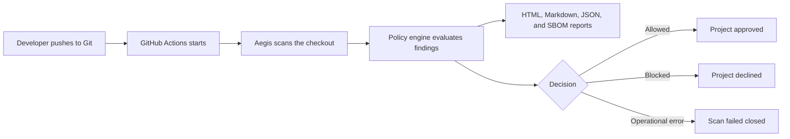
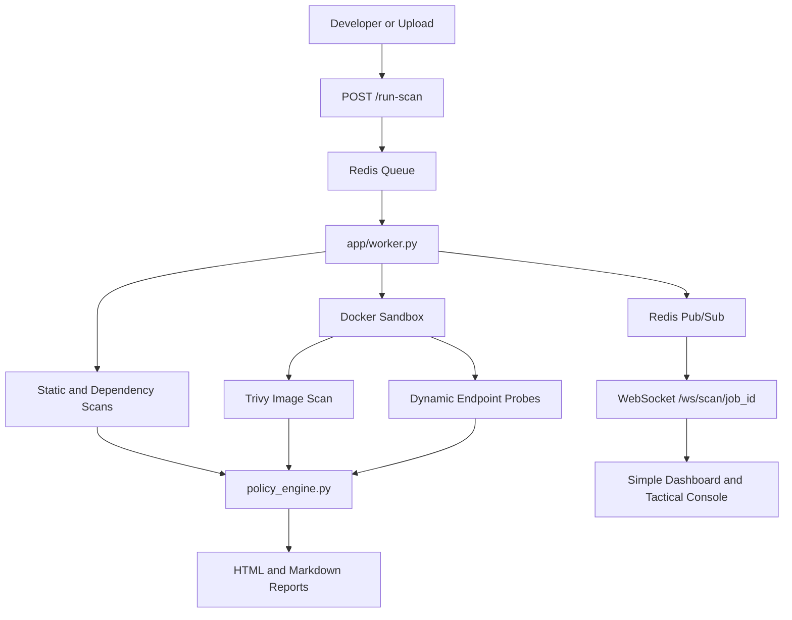

# Aegis: DevSecOps Security Console and CLI Scanner

Aegis is a Python security scanner and DevSecOps workbench. It can be used as a
terminal gate with `aegis scan <filename>` or as a FastAPI web console with
Redis Queue workers, WebSocket log streaming, WAF controls, Docker sandbox
execution, and generated HTML/Markdown security reports.

The current scanner stack focuses on Python source, dependency risk, secrets, suspicious payload signatures, container image checks, and dynamic endpoint probes when Docker is available.

## Documentation

- [Five-minute quick start](docs/QUICKSTART.md)
- [Production deployment](docs/PRODUCTION.md)
- [GitHub integration](docs/GITHUB.md)
- [Operations, notifications, and backups](docs/OPERATIONS.md)
- [Troubleshooting](docs/TROUBLESHOOTING.md)
- [Release checklist](docs/RELEASE_CHECKLIST.md)

---

## Quick CLI Use

After installing or linking the package, scan a file with:

```bash
aegis scan app/main.py
```

Scan a directory:

```bash
aegis scan .
```

Skip Docker, Trivy, and DAST checks for a faster local-only scan:

```bash
aegis scan app/main.py --no-docker
```

Run the quickest local iteration scan:

```bash
aegis scan . --fast
```

Fast mode skips Safety/OSV, Semgrep, ClamAV, Docker sandbox, Trivy, and DAST checks. It still runs Ruff SAST, detect-secrets, YARA/fallback signatures, and the policy engine.

Set a per-tool timeout:

```bash
aegis scan . --timeout 60
```

Write reports to a specific directory:

```bash
aegis scan app/main.py --output ./aegis-reports
```

Show the latest report path:

```bash
aegis report --path
```

Open the latest HTML report:

```bash
aegis report --open
```

Use a custom report directory:

```bash
aegis report --dir ./aegis-reports --path
```

Print a JSON summary for CI or scripts:

```bash
aegis scan app/main.py --no-docker --json
```

Write SARIF for GitHub code scanning or review tooling:

```bash
aegis scan . --sarif
```

Use a project config file:

```yaml
scan:
  no_docker: true
  fail_on: medium,high,critical
  timeout: 120
  sarif: aegis.sarif
  exclude_paths:
    - app/demo_lab.py
  suppressions:
    - tool: Ruff
      rule: S103
      path: app/cli.py
      reason: Git hook installer intentionally writes an executable pre-push hook.
```

Aegis discovers `aegis.yml`, `aegis.yaml`, `.aegis.yml`, or `.aegis.yaml` from the scan target upward. CLI flags override config values. Suppressed findings are written to `suppressions-report.json` so release exceptions stay auditable.

Suppress progress output:

```bash
aegis scan app/main.py --quiet
```

Override blocking severities for supported scanner families:

```bash
aegis scan . --fail-on high,critical
```

The CLI writes reports next to the target:

```txt
.aegis/scans/report.html
.aegis/scans/report.md
```

Normal terminal scans print per-tool timing output. JSON summaries include the same information in a `timings` array:

```txt
Scanner timings:
  Ruff: 0.16s
  Secrets: 0.40s
  YARA: 0.01s
  Policy Engine: 0.05s
  Total: 0.62s
```

Exit codes:

```txt
0 = deployment allowed
1 = security policy blocked
2 = operational or configuration error
```

For CI, use strict mode so a requested scanner failure cannot be interpreted as
a clean report:

```bash
aegis scan . --no-docker --strict --json
```

Every completed scan writes `scan-manifest.json` beside the reports. It records
the Aegis version, timestamps, requested modes, policy result, final exit code,
and the completion state of each scanner.

---

## Local Development Commands

Run the CLI from the source checkout:

```bash
./bin/aegis scan app/main.py
```

Expose the short `aegis` command locally through npm:

```bash
npm link
aegis scan app/main.py
```

Or install shell aliases:

```bash
./scripts/setup_alias.sh
source ~/.zshrc
aegis scan app/main.py
```

Start the web console:

```bash
aegis start
```

This checks Docker and ports, generates a private `.env.aegis`, starts
PostgreSQL, Redis, the worker, dashboard, and local reverse proxy, waits for
health, then opens the one-time setup wizard. To avoid opening a browser:

```bash
aegis start --no-open
```

The generated local stack is available at `http://localhost`. The setup token
is carried in the URL fragment and is not sent in request URLs or access logs.
The wizard rotates the temporary administrator password and stores the initial
workspace, repository reference, and scan preset. It permanently disables
itself after successful completion.

For the older Python-only development server:

```bash
chmod +x setup.sh
./setup.sh
```

Intentionally vulnerable training routes are disabled unless you opt in:

```bash
AEGIS_ENABLE_DEMO_LAB=true ./setup.sh
```

For local automation, state-changing dashboard actions can still use a service token:

```bash
AEGIS_ADMIN_TOKEN="$(openssl rand -hex 24)" ./setup.sh
```

Requests to `/run-scan`, `/toggle-waf`, and `/save-waf-rules` must then include `X-Aegis-Token: <token>`. CORS defaults to localhost origins; set `AEGIS_CORS_ORIGINS` to a comma-separated allowlist when deploying elsewhere.

The production Compose stack runs Caddy, the dashboard, an RQ worker, Redis, and
PostgreSQL. Only Caddy publishes ports. Caddy obtains and renews TLS certificates,
proxies HTTP/WebSocket traffic, and emits JSON access logs. PostgreSQL stores
users, API tokens, WAF rules, and application state; Redis stores bounded job
state and rate-limit counters.

Create a production environment file before starting it:

```bash
cp .env.production.example .env
# Replace every placeholder, point AEGIS_DOMAIN DNS at this host, then:
docker compose up --build -d
```

Production startup fails closed unless authentication, PostgreSQL, Redis, an RQ
worker, explicit host/origin allowlists, and strong secrets are configured.
The initial administrator is created once from the bootstrap variables. Remove
the bootstrap password from the runtime environment after the first successful
deployment. When `AEGIS_SETUP_TOKEN` is configured, open
`https://<AEGIS_DOMAIN>/setup#<AEGIS_SETUP_TOKEN>` to claim the administrator
through the first-run wizard.

Access roles:

- `viewer`: read reports, SBOMs, dependency data, and scan streams.
- `operator`: viewer permissions plus starting scans and viewing owned jobs.
- `admin`: all permissions plus WAF controls, user creation, and API-token issue.

### Projects and scan workflow

Open `/projects` to create project-scoped workspaces. Each project has members,
a default branch and scan preset, independent scan history, retry/cancel controls,
live progress, and a count of findings not present in its previous completed scan.

Presets:

- `quick`: fast local SAST/signature checks with slow external scanners skipped.
- `standard`: static analysis, dependency, secret, and malware checks.
- `deep`: standard checks plus sandbox execution, DAST, and container scanning.

Project administrators can grant `viewer`, `operator`, or `admin` membership
through `PUT /api/projects/{project_id}/members`.

### GitHub connection

Register a GitHub OAuth app with callback URL:

```txt
https://your-aegis-domain/api/github/callback
```

Then configure:

```bash
AEGIS_GITHUB_CLIENT_ID=...
AEGIS_GITHUB_CLIENT_SECRET=...
AEGIS_GITHUB_CALLBACK_URL=https://your-aegis-domain/api/github/callback
AEGIS_ENCRYPTION_KEY="$(python -c 'from cryptography.fernet import Fernet; print(Fernet.generate_key().decode())')"
```

Users can connect GitHub from `/projects`, browse repositories available to
their GitHub account, import one as an Aegis project, and scan its default
branch. OAuth uses authorization-code flow with PKCE and expiring state.
Access tokens are encrypted in PostgreSQL. Private-clone credentials are passed
to Git through process environment configuration rather than command arguments.

### Notifications and operations

Project administrators can configure Slack, Teams Workflow, signed HTTPS
webhook, and SMTP email notifications for completed, blocked, failed, and
cancelled scans. Notification destinations are encrypted in PostgreSQL.

The `/admin` operations console provides user management, API-token issuance
and revocation, service diagnostics, durable audit events, and recent structured
request logs.

```bash
aegis logs --follow
aegis backup --output backups/aegis.zip
aegis restore backups/aegis.zip --yes
aegis upgrade
aegis stop
```

Sessions are signed, HTTP-only, `SameSite=Strict`, secure cookies with CSRF
validation on mutations. Automation can use `Authorization: Bearer <token>`.
Create users with `POST /api/users` and issue a token once with
`POST /api/users/{id}/tokens`; both operations require an administrator session.

Container probes:

```txt
/health = process liveness
/ready  = PostgreSQL, required Redis, and RQ worker readiness
/metrics = Prometheus metrics (AEGIS_METRICS_TOKEN bearer authentication)
```

Request logs are JSON and include a generated/request-provided request ID,
status, duration, route, and client address without query strings or bodies.
Uploaded Python files are limited to 1 MiB by default; change
`AEGIS_MAX_UPLOAD_BYTES` if the deployment needs a different limit.

Run the browser authentication and accessibility suite with:

```bash
npm install
npx playwright install chromium
npm run test:e2e
```

---

## Package Installation

Install as a Python CLI with pipx:

```bash
pipx install git+https://github.com/huslenine999/aegis
aegis scan app/main.py
```

Or install into an active Python environment:

```bash
pip install git+https://github.com/huslenine999/aegis
aegis scan app/main.py
```

For local development, install the checkout in editable mode:

```bash
pip install -e ".[dev]"
aegis scan app/main.py
```

The Python distribution name is `aegis-security-console`; it exposes the command:

```txt
aegis
```

The npm wrapper remains available from the GitHub package source:

```bash
npm install -g github:huslenine999/aegis
aegis scan app/main.py
```

The npm package also exposes the command:

```txt
aegis
```

The public npm name `aegis` is already taken by another package. If that registry
name becomes available or transferred, the install command can become
`npm install -g aegis`. Homebrew distribution is intentionally not advertised
until a versioned tap with complete Python dependency resources is published.

---

## Health and Version Checks

Check local scanner dependencies:

```bash
aegis doctor
aegis doctor --json
```

Print the package version:

```bash
aegis version
```

---

## Cloud Approval Gate

Aegis can run as the approval gate after developers push code to GitHub:



This repository wires that flow in `.github/workflows/security-pipeline.yml`.
The `security-gate` job checks the pushed project out separately from a reviewed,
immutable Aegis scanner and policy revision, then runs:

```bash
aegis scan target --no-docker --strict --output aegis-reports --json --fail-on medium,high,critical
```

Exit code `0` approves the project, `1` means the security policy found blocking
issues, and `2` means the scan could not complete reliably. The Action exposes
the corresponding `decision` output as `approved`, `declined`, or `error`.

Generated cloud reports are available in the GitHub Actions run summary and in the `aegis-approval-reports` artifact.

To use Aegis from another GitHub repository:

```yaml
name: Aegis Security Gate

on:
  push:
    branches: ["main"]
  pull_request:
    branches: ["main"]

jobs:
  security-gate:
    runs-on: ubuntu-latest
    steps:
      - uses: actions/checkout@df4cb1c069e1874edd31b4311f1884172cec0e10 # v6.0.3
      - uses: huslenine999/aegis@e292c60770bee621fb70ba07b71cc9f2a525ea1a
        with:
          scan-target: .
          output-dir: aegis-reports
          no-docker: "true"
          strict: "true"
          fail-on: medium,high,critical
```

The example pins both Actions to reviewed commits. Update the Aegis SHA only
after validating a new release. Keep the policy configuration and required
workflow in a protected location; a pull request that can modify its own
security workflow is not an independent approval boundary.

---

## Scanner Coverage

Aegis coordinates these scanner paths:

1. Ruff SAST checks using the Bandit-compatible `S` rule family.
2. Semgrep custom Python rules for SQL injection, command execution, unsafe eval, pickle, and weak hashes.
3. Safety and OSV dependency analysis for `requirements.txt`.
4. CVSS v3.1 parsing and exploitability scoring.
5. detect-secrets scanning for hardcoded credentials.
6. YARA or fallback signature scans for webshell and suspicious execution patterns.
7. ClamAV or fallback malware signature checks.
8. Docker sandbox execution with memory, CPU, and PID limits.
9. Trivy image scanning when Docker and Trivy are available.
10. DAST-style endpoint probes against active sandbox containers.
11. WAF-aware risk reduction in the web console flow.

The CLI records intentional skips and operational failures separately in
`scan-manifest.json`. In strict mode, failed requested scanners return exit code
`2`; explicitly disabled checks remain auditable skips.

Shared scanner implementations for Semgrep rule generation, YARA fallback matching, and ClamAV fallback matching live in `app/scanners.py`. The CLI and web worker call that shared module with different log adapters, so report shapes stay consistent across terminal and dashboard scans.

When Docker scanning is enabled, the CLI builds a temporary sandbox image, starts the container with memory, CPU, PID, and `WAF_ENABLED` controls, waits for the actual localhost sandbox URL to become healthy, then runs Trivy and DAST probes against that URL.

---

## Web Console Architecture



The dashboard defaults to Workbench view, a focused interface for daily
security decisions:

- Overview cards for verdict, exploitability, WAF status, and latest scan.
- Primary scan, upload, report, and dossier actions.
- Stepper-style scan progress.
- Findings tab with severity filters and fix guidance.
- Reports tab with HTML, Markdown dossier, SBOM, and copy-path actions.
- WAF tab with status/toggle and a route to the advanced editor.
- Logs tab with live scan events and browser-local scan history.
- Settings tab with reduced-motion, theme, and default-view controls.

The detailed assessment remains a separate report page instead of being folded
into the dashboard. This keeps the workbench optimized for triage while the
report provides scanner-by-scanner evidence, a deployment decision, SBOM and
dossier downloads, responsive review, and print/save-to-PDF output.

Tactical view preserves the original CRT-style console with live scan state updates, EventSource telemetry, WAF rule controls, dependency graph visualization, threat simulation, and generated compliance reports.

The intentionally vulnerable lab endpoints (`/user`, `/ping`, `/calculate`, `/load-profile`, `/download`, `/hash`, `/xss`, `/ssrf`, and `/debug-info`) live in `app/demo_lab.py` and are disabled in the default console process. Enable them only for local training or sandboxed demonstrations with `AEGIS_ENABLE_DEMO_LAB=true`.

---

## Production Readiness

The current release is suitable for a controlled internal production pilot
after a Docker deployment rehearsal and backup/restore drill. It includes
session authentication, global/project RBAC, protected report and WebSocket
access, Redis rate limits, PostgreSQL state, structured logs, Prometheus
metrics, Caddy TLS, and real-browser accessibility coverage.

Before operating Aegis as a public multi-tenant SaaS:

- introduce versioned database migrations;
- move generated artifacts to project/run-scoped object storage;
- add MFA, password reset, account disablement, and session revocation;
- replace broad GitHub OAuth scope with a fine-grained GitHub App;
- add automated pull-request checks and review comments;
- run load, failover, penetration, and disaster-recovery testing;
- connect logs, metrics, and errors to production alerting systems.

See [the delivery handoff](handoff.md) for the complete current-state assessment.

---

## Project Structure

```txt
aegis/
├── app/
│   ├── cli.py                  # CLI scanner entrypoint for aegis scan
│   ├── main.py                 # FastAPI app, WAF middleware, routes, WebSockets
│   ├── auth.py                 # Sessions, passwords, API tokens, and RBAC
│   ├── projects.py             # Projects, memberships, and scan history
│   ├── github_integration.py   # OAuth PKCE and encrypted GitHub credentials
│   ├── notifications.py        # Slack, Teams, webhook, and email delivery
│   ├── audit.py                # Durable security audit events
│   ├── observability.py        # Structured request logs and metrics
│   ├── demo_lab.py             # Opt-in intentionally vulnerable training routes
│   ├── worker.py               # Redis Queue worker for async scans
│   ├── secure_main.py          # Hardened demo target
│   ├── database.py             # PostgreSQL/SQLite schema and Redis client
│   ├── sandbox.py              # Docker sandbox lifecycle and telemetry
│   ├── scanners.py             # Shared Semgrep, YARA, and ClamAV scanner helpers
│   ├── static/
│   │   ├── enhanced-dashboard.css
│   │   └── enhanced-dashboard.js
│   └── templates/
│       ├── index.html          # Simple dashboard shell and tactical UI
│       ├── projects.html       # Project and scan workflow
│       ├── admin.html          # Operations console
│       ├── setup.html          # First-run setup wizard
│       └── report_template.html
├── deploy/                     # Caddy, Prometheus, and Grafana examples
├── docs/                       # Task-focused operational documentation
├── bin/
│   ├── aegis                   # Local shell wrapper
│   └── cli.js                  # npm executable wrapper
├── rules/
│   └── semgrep_rules.yaml
├── scripts/
│   ├── seed_db.py
│   └── setup_alias.sh
├── scans/                      # Web-console scan output
├── tests/
│   ├── test_cli.py
│   ├── test_policy.py
│   ├── test_upload_scan.py
│   └── ...
├── policy_engine.py
├── aegis.yml
├── package.json
├── pyproject.toml
├── requirements.txt
└── setup.sh
```

---

## Testing

Focused scanner, CLI, sandbox, and policy-adjacent verification:

```bash
./venv/bin/python -m pytest tests/test_cli.py tests/test_sandbox.py tests/test_phase1.py tests/test_phase3.py::test_run_clamav_scan_eicar tests/test_phase3.py::test_run_clamav_scan_backdoor
```

Syntax and help checks:

```bash
./venv/bin/python -m py_compile app/main.py app/cli.py app/worker.py
./venv/bin/python -m py_compile app/scanners.py app/cli.py app/worker.py
node --check app/static/enhanced-dashboard.js
./venv/bin/python app/cli.py --help
./venv/bin/python app/cli.py scan --help
./venv/bin/python app/cli.py doctor --json
./venv/bin/python app/cli.py version
```

Dashboard smoke checks:

```txt
/ 200
/static/enhanced-dashboard.css 200
/static/enhanced-dashboard.js 200
/get-scan-results 200
```

Current verification status:

```txt
Python suite: 120 passed.
Playwright/axe suite: 6 passed.
Critical Ruff checks and pip dependency consistency checks pass.
Dashboard, projects, operations, login, setup, and report contracts cover
responsive, accessibility, print, RBAC, and reduced-motion behavior.
```

If a Docker, WAF, or DAST integration path stalls, `pytest-timeout` fails the specific test instead of hanging the whole validation job.

The GitHub Actions workflow in `.github/workflows/security-pipeline.yml` runs
the cloud approval gate, package/wheel checks, Action contract validation,
focused CLI/policy tests, the full timeout-protected suite, and a SARIF smoke
scan on pushes and pull requests.

---

## Git Hook

Install Aegis as a pre-push gate in the current Git repo:

```bash
aegis install-hook
```

Remove it:

```bash
aegis uninstall-hook
```

The hook runs:

```bash
aegis scan "$REPO_DIR" --fast
```

and blocks the push when the policy engine returns a non-zero exit code.

---

## Notes for Teams

- Use `aegis scan <filename>` for quick local review before committing.
- Use `aegis scan . --fast` for quick local feedback when you do not need the slower optional scanners.
- Use `aegis scan . --no-docker` in fast pre-push or CI jobs when Docker is unavailable.
- Use `aegis scan . --json --output ./reports` when integrating with automation.
- Use `aegis report --open` after a scan to inspect the generated HTML report.
- Run the full dashboard flow when you want live logs, WAF controls, sandbox telemetry, and visual reports.
- Treat generated `.aegis/scans/` output as local scan artifacts unless you explicitly want to archive reports.
