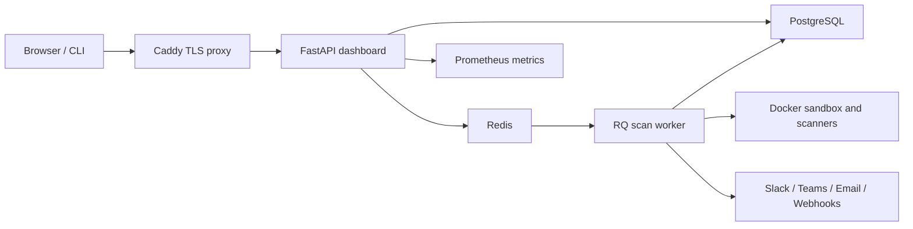

# Aegis

Security scanning, project triage, and deployment decisions in one self-hosted
workbench.

Aegis combines a Python security-scanning CLI, a GitHub Action, and a web
console for teams that want repeatable security gates without sending source
code to a hosted third party.

## Commercial direction

Aegis is positioned for small engineering teams that need a private, explainable
release-security decision without buying a large AppSec platform. The public
product overview and founding-pilot offer are available at `/welcome` when the
workbench is running. See [docs/MONETIZATION.md](docs/MONETIZATION.md) for the
recommended customer profile, offer ladder, and path to paid hosted plans.

## Highlights

- Local and CI security gates with deterministic exit codes.
- Project workspaces, member roles, scan history, and new-finding comparison.
- GitHub OAuth import for public and private repositories.
- Quick, standard, and deep scan presets.
- SAST, dependency, secret, malware, container, and dynamic checks.
- HTML, Markdown, SARIF, SBOM, JSON, and report-bundle outputs.
- Authenticated WebSocket scan progress and bounded worker logs.
- Slack, Teams Workflow, email, and signed webhook notifications.
- PostgreSQL persistence, Redis/RQ workers, Caddy TLS, and Prometheus metrics.
- Administration for users, API tokens, audit events, WAF rules, and diagnostics.
- Tenant-scoped authorization, scoped API tokens, login lockout, and encrypted TOTP MFA.
- Ed25519-signed evidence manifests with independently verifiable artifact hashes.

## Quick Start

### Scan From The Terminal

Install the CLI in an isolated environment:

```bash
pipx install aegis-security-console
```

Run a scan:

```bash
aegis scan .
```

Try Aegis on a generated vulnerable sample app:

```bash
aegis demo
```

Generate SARIF for code-scanning platforms:

```bash
aegis scan . --sarif
```

Exit codes:

| Code | Meaning |
| ---: | --- |
| `0` | Deployment allowed |
| `1` | Security policy blocked |
| `2` | Scanner, configuration, or operational failure |

Reports explain what failed, why it matters, how to fix it, whether the finding
is new, and when suppression is acceptable.

Verify service-generated evidence against a pinned deployment public key:

```bash
aegis verify-evidence ./scan-manifest.json --public-key YOUR_PINNED_KEY
```

### Start The Workbench

The complete local stack requires a source checkout, Docker, and Docker Compose
v2:

```bash
git clone https://github.com/huslenine999/aegis.git
cd aegis
python3 -m pip install -e ".[dev]"
aegis start
```

`aegis start`:

1. checks Docker and required ports;
2. creates owner-only local secrets in `.env.aegis`;
3. starts PostgreSQL, Redis, the RQ worker, dashboard, and Caddy;
4. waits for the health endpoint;
5. opens the one-time setup wizard.

The local workbench is available at [http://localhost](http://localhost).

To start without opening a browser:

```bash
aegis start --no-open
```

## Common CLI Commands

```bash
# Fast local feedback
aegis scan . --fast

# Skip Docker, Trivy, and DAST
aegis scan . --no-docker

# Machine-readable summary
aegis scan . --json --quiet

# Fail closed when a requested scanner cannot complete
aegis scan . --strict

# Write reports to a dedicated directory
aegis scan . --output ./aegis-reports

# Locate or open the latest report
aegis report --path
aegis report --open
```

Non-strict scans can still return a policy decision from available reports, but
the JSON summary and `scan-manifest.json` include `operational_failures` when a
scanner fails. Use `--strict` for CI and release gates.

## Web Workflow

1. Complete first-run administrator setup.
2. Open `/projects`.
3. Create a project or connect GitHub and import a repository.
4. Select a scan preset.
5. Follow scanner progress and logs in real time.
6. Review new findings and the deployment verdict.
7. Retry, cancel, export, or notify the relevant team.

### Scan Presets

| Preset | Intended use | Included checks |
| --- | --- | --- |
| Quick | Local and development feedback | Fast SAST and signature checks |
| Standard | Pull-request or branch gate | Static analysis, dependencies, secrets, and malware |
| Deep | Release audit | Standard checks plus sandbox execution, DAST, and container scanning |

## Scanner Coverage

| Area | Tools and behavior |
| --- | --- |
| Python SAST | Ruff security rules |
| Pattern analysis | Semgrep with Aegis rules |
| Dependencies | OSV by default; licensed Safety CLI integration is opt-in |
| Secrets | detect-secrets |
| Malware/signatures | YARA and ClamAV-compatible fallback checks |
| Containers | Trivy when Docker is available |
| Dynamic testing | Sandbox execution and DAST probes |
| Policy | Configurable severity gate and audited suppressions |

Scanner availability depends on the selected preset and local runtime. Requested
scanner failures are treated as operational failures in strict mode, not as
clean results.

## Project Configuration

Aegis discovers `aegis.yml`, `aegis.yaml`, `.aegis.yml`, or `.aegis.yaml` from
the target directory upward.

```yaml
scan:
  no_docker: true
  fail_on: medium,high,critical
  timeout: 120
  sarif: aegis.sarif
  exclude_paths:
    - app/demo_lab.py
  suppressions:
    - tool: Ruff
      rule: S103
      path: app/cli.py
      reason: Reviewed executable hook creation.
      approved_by: application-security
      ticket: SEC-123
      expires_at: 2027-07-20
```

CLI options override configuration-file values. A suppression is active only
when it has a meaningful reason, approver, tracking ticket, and future ISO-8601
expiry. Applied, expired, and invalid exceptions are written to the versioned
`suppressions-report.json`; expired or malformed entries never hide findings.

## Architecture



Production services:

- **Caddy** terminates TLS and proxies HTTP/WebSocket traffic.
- **FastAPI** provides authentication, RBAC, APIs, reports, and the UI.
- **PostgreSQL** stores users, projects, scan history, encrypted integrations,
  notification channels, audit events, WAF rules, and application state.
- **Redis/RQ** provides queues, rate limits, live job state, and bounded logs.
- **Worker** clones repositories and executes scanner pipelines.

## Security Model

Global and project roles:

| Role | Capabilities |
| --- | --- |
| Viewer | Read project results, reports, SBOMs, and scan streams |
| Operator | Viewer access plus start, cancel, and retry scans |
| Admin | User, token, membership, notification, WAF, and operations administration |

Security controls include:

- PBKDF2 password hashes;
- revocable server-side HTTP-only sessions that honor current account state;
- secure `SameSite` cookies in production;
- CSRF validation for session mutations;
- bearer API tokens with revocation;
- project membership checks;
- per-job WebSocket ownership;
- Redis-backed request and connection rate limits;
- encrypted GitHub and notification credentials;
- project/run-scoped artifacts with membership checks and integrity hashes;
- fail-closed worker decisions when required scanner evidence is unavailable;
- explicit production host and CORS allowlists.

## GitHub Integration

Create a GitHub OAuth app with this callback:

```text
https://aegis.example.com/api/github/callback
```

Configure:

```bash
AEGIS_GITHUB_CLIENT_ID=...
AEGIS_GITHUB_CLIENT_SECRET=...
AEGIS_GITHUB_CALLBACK_URL=https://aegis.example.com/api/github/callback
AEGIS_ENCRYPTION_KEY=...
```

Generate a valid encryption key:

```bash
python -c 'from cryptography.fernet import Fernet; print(Fernet.generate_key().decode())'
```

The OAuth flow uses PKCE and expiring state. Access tokens are encrypted in
PostgreSQL. Git clone credentials are passed through process environment
configuration rather than command arguments or logs.

See [GitHub integration setup](docs/GITHUB.md).

## Notifications

Project administrators can subscribe channels to `completed`, `blocked`,
`failed`, and `cancelled` events.

Supported destinations:

- Slack incoming webhooks;
- Microsoft Teams Workflow webhooks;
- generic HTTPS webhooks with optional HMAC signatures;
- SMTP email.

Webhook destinations must resolve to public addresses. Notification delivery
failure is recorded but does not convert a completed scan into a failed scan.

See [operations and notifications](docs/OPERATIONS.md).

## Production Deployment

Copy the environment template:

```bash
cp .env.production.example .env
```

Replace every placeholder, point `AEGIS_DOMAIN` DNS at the deployment host, and
start the stack:

```bash
docker compose up --build -d
```

Production startup fails closed unless authentication, PostgreSQL, Redis,
workers, explicit host/origin allowlists, and required secrets are configured.

Health endpoints:

| Endpoint | Purpose |
| --- | --- |
| `/health` | Process liveness |
| `/ready` | PostgreSQL, Redis, and worker readiness |
| `/metrics` | Authenticated Prometheus metrics |

Deploy a published image:

```bash
export AEGIS_IMAGE=ghcr.io/huslenine999/aegis:v2.3.0
docker compose pull dashboard worker
docker compose up -d --no-build
```

See [production deployment](docs/PRODUCTION.md).

## Operations

Open `/admin` for:

- user and role management;
- API-token issuance and revocation;
- PostgreSQL, Redis, worker, GitHub, and SMTP diagnostics;
- durable audit events;
- recent request IDs, statuses, and latency.

Lifecycle commands:

```bash
aegis logs --follow
aegis backup --output backups/aegis.zip
aegis restore backups/aegis.zip --yes
aegis upgrade
aegis stop
```

Backups contain a clean PostgreSQL dump, generated reports, and a versioned
manifest. Redis job events are bounded transient state and are not backed up.

Prometheus and Grafana examples are available in [`deploy/`](deploy/).

## GitHub Action

Aegis can block a workflow using the repository Action:

```yaml
- name: Aegis security gate
  uses: huslenine999/aegis@<reviewed-commit-sha>
  with:
    scan-target: .
    no-docker: "true"
    fail-on: medium,high,critical
```

Pin the Action to a reviewed immutable commit SHA.

## Development

Install development dependencies:

```bash
python3 -m venv venv
./venv/bin/python -m pip install -e ".[dev]"
npm install
npx playwright install chromium
```

Run verification:

```bash
./venv/bin/python -m compileall -q app policy_engine.py tests
./venv/bin/python -m pytest -q
npm run test:e2e
git diff --check
```

Current baseline: **138 Python tests** and **6 Playwright/axe browser tests**.
CI also enforces focused type checks, full Ruff linting, browser authentication
flows, and serious/critical accessibility checks.

The intentionally vulnerable demo routes are disabled by default. Enable them
only for isolated training:

```bash
AEGIS_ENABLE_DEMO_LAB=true ./setup.sh
```

## Production Readiness

Aegis is suitable for a controlled internal production pilot after a real Docker
deployment rehearsal and backup/restore drill.

Before operating it as a public multi-tenant SaaS:

- move the run-scoped local artifact backend to tenant-scoped object storage;
- add MFA, password reset, and enterprise identity federation;
- replace broad GitHub OAuth scope with a fine-grained GitHub App;
- add automated pull-request checks and review comments;
- run load, failover, penetration, and disaster-recovery testing;
- connect logs, metrics, errors, and alerts to production systems.

See [the delivery handoff](handoff.md) for the detailed assessment.

## Documentation

- [Quick start](docs/QUICKSTART.md)
- [Production deployment](docs/PRODUCTION.md)
- [GitHub integration](docs/GITHUB.md)
- [Operations and notifications](docs/OPERATIONS.md)
- [Troubleshooting](docs/TROUBLESHOOTING.md)
- [Release checklist](docs/RELEASE_CHECKLIST.md)
- [Threat model](docs/THREAT_MODEL.md)
- [Security policy](SECURITY.md)
- [Contributing](CONTRIBUTING.md)

## License

[MIT](LICENSE)
