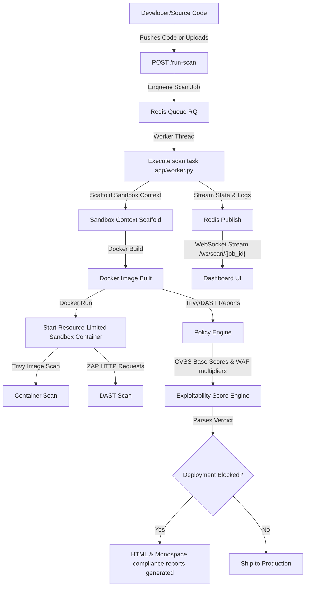

# Aegis: Automated DevSecOps Pipeline & Retro CRT Security Console

Aegis is an interactive DevSecOps dashboard and security gate that automates security verification for Python source code, third-party dependencies, and container images. It provides live Web Application Firewall (WAF) mitigation controls, a dynamic Docker sandbox containerization engine, background task workers, real container vulnerability audits (Trivy), and real-time WebSocket / SSE diagnostics monitoring.

---

## 📺 Immersive UI/UX & Visual Aesthetics

Aegis features a premium, immersive **90s Retro CRT Terminal** styled with glowing phosphor components, high-contrast themes, scanlines, and layout vignette shadows:

* **Typography & Fonts**: Paired retro vt323 titles with **Fira Code** and Share Tech Mono Google Fonts to ensure log widgets, tooltips, and lists have premium readability.
* **Cyber HUD Brackets & Glassmorphic Surfaces**: Styled with absolute top-left and bottom-right corner bracket accents (`::before`/`::after` borders) and glassmorphic blurs (`backdrop-filter: blur(10px)`) across all console panels and report templates.
* **Mechanical Button Controls**: Micro-animations with translateY transitions and cubic-bezier response curves applied to action buttons, including custom styling overrides for the CycloneDX SBOM download button.
* **3D Vanishing Grid Horizon**: The background features an animated HTML5 vector wireframe grid (or falling Matrix digital rain code theme) that responds to mouse coordinates with warp physics.
* **Enhanced Vector Radar Canvas**: concentrically dashed radar lines, numerical angle azimuth indicators, and expanding target impact waves.
* **Dynamic Dependency Network Graph**: Dynamic pulsing red circles highlighting vulnerable library packages, and animated data packet streams sliding along dependency links.
* **Dynamic Deployment Gate Banners**: Interactive red/green pulsing alerts (`status-blocked` / `status-passed`) that animate the critical pipeline gate decision dynamically.
* **Accessibility Motion Control**: Integrated `@media (prefers-reduced-motion: reduce)` rules that automatically disable screen flicker overlays, pause canvas updates, and hide sliding packet streams for a comfortable, accessible visual experience.

---

## 🛡️ Core Architecture



* **HTML Report**: `scans/report.html` - Visual tactical mainframe report with diagnostic details of Bandit, Semgrep, OSV Dependency Audit, Trivy, Secrets, YARA, ClamAV, and ZAP DAST scanner findings.
* **Markdown Report**: `scans/report.md` - Optimized for GitHub Job summaries.

---

## 📂 Project Structure

```txt
aegis/
├── app/
│   ├── main.py                # Main FastAPI dashboard, WAF middleware & WebSocket routes
│   ├── worker.py              # RQ background worker executing scanner tasks [NEW]
│   ├── secure_main.py         # Secure equivalent code (vulnerability fixes)
│   ├── database.py            # SQLite database for persistent actions
│   ├── sandbox.py             # Docker sandbox lifecycle & telemetry manager
│   └── templates/
│       ├── index.html         # Main CRT terminal dashboard template
│       └── report_template.html # CRT diagnostics report template
├── rules/
│   └── semgrep_rules.yaml     # Custom Semgrep SAST rule patterns
├── scripts/
│   └── seed_db.py             # Pre-populates simulation database tables
├── scans/
│   ├── report.html            # Compiled static scan output
│   ├── report.md              # Compiled markdown output
│   ├── osv-cache.json         # Local 24h TTL cache for OSV API lookups
│   └── sandbox-status.json    # Shared state file for sandbox connection status
├── tests/
│   ├── conftest.py            # Mocks Redis and forces synchronous RQ execution in tests [NEW]
│   ├── test_osv_score.py      # Tests for OSV API parsing & CVSS scoring
│   ├── test_phase1.py         # Tests for secrets, YARA, and SBOM
│   ├── test_phase2.py         # Tests for Semgrep and dependency graphs
│   ├── test_phase3.py         # Tests for ClamAV and ZAP DAST
│   ├── test_policy.py         # Test suite for policy engine thresholds
│   ├── test_sandbox.py        # Test suite for sandbox builder & limits
│   ├── test_telemetry.py      # Test suite for EventSource SSE logs & spikes
│   ├── test_upload_scan.py    # Test suite for file upload vulnerabilities
│   └── test_waf.py            # Test suite for Web Application Firewall rules
├── policy_engine.py           # Evaluates scanner outputs against severity policies
├── setup.sh                   # Automated setup script (verifies Redis, launches RQ worker and Uvicorn server)
├── requirements.txt           # Production dependencies
├── requirements-dev.txt       # Dev & scanning dependencies (pytest, bandit, safety, etc.)
├── Dockerfile                 # Containerized image file
└── README.md                  # Project documentation
```

---

## 🔍 Integrated Scanner Suites & Telemetry

Aegis coordinates multi-layer static and dynamic scanners:

1. **Python SAST Engine (Bandit & Semgrep)**: Audits code for SQL Injection, Command Injection (RCE), Unsafe Eval, Weak Hashes, and Pickle deserialization using custom rules.
2. **Software Composition Analysis (OSV API & Safety)**: Performs live SCA queries to the public OSV database, fetching CVSS vectors and caching results locally for 24 hours.
3. **CVSS v3.1 Base Score Parser**: Implements the official CVSS v3.1 mathematical calculation formula to determine precise vulnerability severity weights.
4. **Dynamic Docker Sandbox Runner**: Containerizes targets inside alpine-based isolation running with strict constraints (`--memory="128m"`, `--cpus="0.5"`, `--pids-limit=50`).
5. **Container Image Scan (Trivy)**: Audits built Docker image layers for system-level CVEs.
6. **Secret Scanner (detect-secrets)**: Analyzes the codebase for hardcoded passwords, keys, and tokens.
7. **YARA Pattern Scanner**: Scans for webshell, obfuscated payload, and suspicious shell spawning signatures.
8. **ClamAV Antivirus Scanner**: Checks the filesystem for malware (e.g. EICAR test string) and base64 backdoors.
9. **OWASP ZAP DAST Scanner**: Performs in-memory dynamic crawling and HTTP requests mapping, routing scans directly against active sandbox containers.
10. **Exploitability Score Calculator**: Computes risk percentages based on CVSS scores.
11. **Real-time WebSockets & SSE**: Streams live scan execution state progress (`queued`, `running`, `analyzing`, `correlating`, `reporting`, `completed`), stdout scanner logs, Docker resource statistics, and parsed packet captures directly to the CRT monitor dashboard.

---

## 🛠️ Getting Started

### 📦 Installation via Package Managers (Recommended)

#### Option A: Homebrew (macOS / Linux)
You can tap the repository and install Aegis globally via Homebrew:
```bash
# Tap the repository
brew tap huslenine999/aegis

# Install the aegis package
brew install aegis

# Start the console globally from anywhere
aegis
```

#### Option B: npm (NodeJS)
You can install Aegis globally via npm:
```bash
# Install the package globally
npm install -g aegis-secure-console

# Run the console globally from anywhere
aegis-secure-console
```

---

### 💻 Local Source Setup & Run (Automated)
You can set up dependencies, configure the SQLite databases, start/verify the Redis daemon, launch the background task worker, and start the FastAPI application in one command:
```bash
chmod +x setup.sh
./setup.sh
```

### 2. Manual Setup
Activate a virtual environment and install packages:
```bash
python3.14 -m venv venv
source venv/bin/activate
pip install -r requirements.txt
```

Start the Redis server on `localhost:6379`.

Start the RQ worker in a separate terminal:
```bash
source venv/bin/activate
./venv/bin/rq worker --with-scheduler
```

Launch the FastAPI web server in a separate terminal:
```bash
source venv/bin/activate
./venv/bin/uvicorn app.main:app --port 5001 --reload
```

Open your browser to `http://127.0.0.1:5001`.

---

## 🧪 Testing

Aegis includes pytest coverage for all scanning engines, policy thresholds, background queues, and WAF intercept controls:
```bash
# Activate virtual environment
source venv/bin/activate

# Execute tests
pytest
```
*Verification status:* **60/60 tests passing successfully.**

---

## 🚀 DevSecOps Implementation Workflow for Teams

You can use the patterns shown in Aegis to strengthen security in your production pipelines:

1. **Adopt Automated Code Linters**: Run tools like `bandit` or `semgrep` as a pre-commit hook or inside your PR tests.
2. **Fail Fast with Policy Engines**: Use `policy_engine.py` to assert scan findings. Return `exit 1` to fail pipelines automatically when any `HIGH` or `CRITICAL` vulnerability is introduced.
3. **Audit Third-Party Packages**: Run OSV or Safety scans to prevent outdated dependencies with known CVEs from reaching your production containers.
