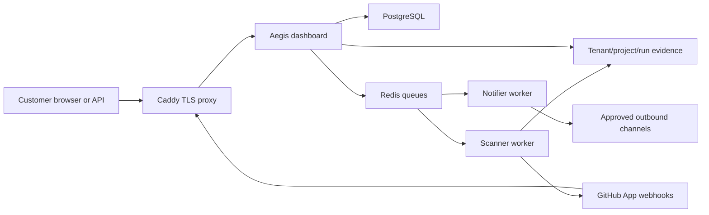

# Architecture and data flow

The supported commercial topology is one customer per isolated deployment.
Caddy terminates TLS. The dashboard authenticates users and authorizes projects.
PostgreSQL stores identity, project, scan and audit metadata. Redis transports
jobs. Scanner workers process hostile source and write signed evidence. A
separate notifier worker owns outbound delivery credentials.

Current scanner workers require database access and GitHub App credentials to
clone private repositories and complete checks. The target regulated topology
replaces this with a credential broker and ephemeral scanner runtime receiving
only a short-lived source lease and evidence-upload capability. Immutable object
storage, KMS keys, OIDC, and external SIEM are also target-state controls, not
features of the local backend.
