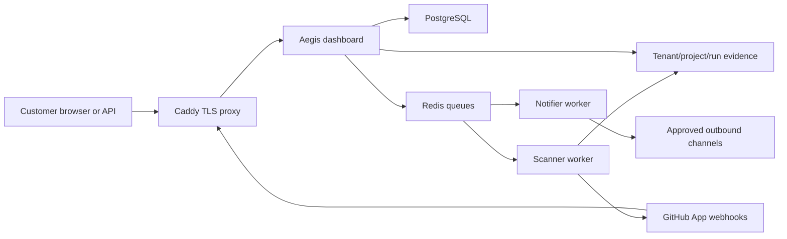

# Architecture and data flow

The supported commercial topology is one customer per isolated deployment.
Caddy terminates TLS. The dashboard authenticates users and authorizes projects.
PostgreSQL stores identity, project, scan and audit metadata. Redis transports
jobs. Scanner workers process hostile source and write signed evidence. A
separate notifier worker owns outbound delivery credentials.

Quick runs Ruff security rules and detect-secrets. Standard adds Semgrep and
OSV. YARA is optional. CodeQL is the opt-in Deep source analyzer for Python and
JavaScript/TypeScript. A dedicated Compose worker streams admitted source into
an offline, unprivileged CodeQL child container; the child receives no host
filesystem mount or application credentials. Removed
Checkov, Safety, ClamAV, Trivy, and DAST results remain readable as historical
evidence. New scan decisions do not claim infrastructure, container, malware,
or runtime testing from CodeQL.

Current scanner workers require database access and GitHub App credentials to
clone private repositories and complete checks. The target regulated topology
replaces this with a credential broker and ephemeral scanner runtime receiving
only a short-lived source lease and evidence-upload capability. Immutable object
storage, KMS keys, OIDC, and external SIEM are also target-state controls, not
features of the local backend.
