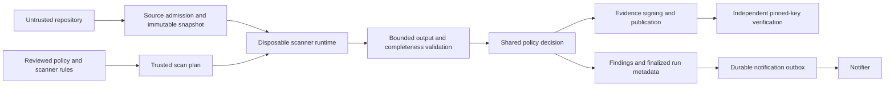

# Aegis: engineering and cybersecurity capstone review

Review date: 2026-09-21. Scope: the current local checkout, implementation, tests, deployment files, and documentation. The findings below began as a read-only review; the implementation follow-up is now recorded in the same worktree. Dependency directories (`node_modules`, `.venv`, and `venv`) were excluded from source inspection. The existing Python environment was used to execute tests and isolated reproductions.

**Assessment: Aegis demonstrates real security engineering, but its release-decision assurance is weaker than its feature list suggests.** Source snapshots, public-key verification, tenant consistency constraints, bounded scanner output, and authentication transaction protections are substantive work. However, a repository can suppress a required scanner's findings, incomplete dependency analysis can look successful, and an operational error can appear as a passed HTML report. Those undermine the product's central promise.

This review distinguishes **reproduced behavior**, **implementation-confirmed defects**, **conditional architectural risks**, and **evaluation gaps**. No Critical-severity remote compromise was established. High-severity gate and evidence defects should still be fixed before using Aegis for release approval.

## Implementation follow-up started

The first remediation pass addresses the highest-risk, locally testable controls:

- Ruff invocations use an isolated configuration, ignore inline suppressions, and apply trusted exclusions in both CLI and worker paths.
- Dependency manifests preserve parser errors, represent ranges as unresolved, parse Yarn locks, and normalize nested npm lock paths. Strict OSV mode now fails on incomplete inventories, parser errors, stale cache fallback, and query failures; the policy engine propagates those failures to an `ERROR` decision.
- HTML reports distinguish `ALLOWED`, `BLOCKED`, and `ERROR` decisions, including unknown status values.
- Finding auto-resolution requires completed detector coverage and a scan preset at least as broad as the finding's previous run.
- Audit verification includes visible rows with missing chain fields and rejects unchained evidence.
- DAST reads streamed responses under the shared byte budget, closes responses, and compares SQL results with a benign baseline before claiming exposure.
- The displayed risk value is labeled as a heuristic relative-severity index rather than a probability of exploitation; the compatibility API field remains available alongside `risk_index`.

These are implementation changes against the pre-remediation observations below. The fixes are partial where the finding called for broader work (for example, Semgrep policy isolation, complete lockfile schema validation, and full worker isolation); those residual gaps remain open.

## Scanner migration follow-up (2026-09-22)

The current worktree removes Checkov, Safety, ClamAV, Trivy, and the custom DAST probes from new Quick, Standard, and Deep scans. Ruff, Semgrep, OSV, and secret detection remain; YARA is optional. New Deep scans use a dedicated worker and pinned, offline CodeQL child container with bundle-owned query suites. The default Compose deployment keeps Deep disabled until `make codeql-setup` provisions it locally. Historical findings and signed artifacts remain readable and are not treated as remediated merely because a detector was retired. The detailed contract and remaining release gates are in [SCANNER_MIGRATION_PLAN.md](SCANNER_MIGRATION_PLAN.md).

This changes the interpretation of the dated DAST/Checkov/Trivy/Safety/ClamAV observations below: they describe the reviewed pre-migration behavior, not active coverage. CodeQL adds source and data-flow analysis; it does not restore container, infrastructure, malware, or runtime testing. On 2026-09-23, a live CodeQL 2.27.0 ARM64 child container ran offline from the Compose Deep worker and detected the controlled SQL-injection fixture as HIGH. Adversarial credential/egress/cross-run checks, an authenticated browser smoke test, and the held-out benchmark are still needed before making a production assurance claim. The trusted Deep-worker parent retains database, signing, and Docker-daemon capabilities, so F06 remains open.

Focused regression coverage for these changes is passing. The remaining findings are still open work and should be treated as the defense backlog rather than implied guarantees.

## Verification and limits

- Executed the Python suite: **312 passed, 2 skipped, 39.04 seconds**. The skipped tests require the Compose integration environment.
- Measured `app` and `policy_engine` together: coverage reported **70%**. A subprocess coverage shard was malformed, so this is an indicative result, not an authoritative coverage baseline. The ordinary configured 80% threshold applies to selected modules; it is not a whole-project threshold.
- Did not run a fresh browser suite, a live Docker isolation attack, cloud-provider integration, an external penetration test, or a current CVE audit. Findings below do not imply those checks occurred.
- Used temporary targets/databases for reproductions. No private repositories, credentials, or source were sent to external scanners during the review.
- Read the actual control implementations and tests; passing tests were not treated as proof of controls they do not exercise.

| Isolated check before the remediation pass | Observed result |
| --- | --- |
| Strict Quick scan of `def f(user_input): return eval(user_input)` | Blocked, exit 1 |
| Same target plus a target-owned `ruff.toml` suppressing all Python rules | Allowed, exit 0, no operational failures |
| HTML template rendered with `final_status='ERROR'` | Heading says `Deployment passed` |
| Recognized `yarn.lock` with a dependency | Empty package list |
| Malformed `pyproject.toml` | Empty package list, no parser error propagated |
| `requirements.txt` containing `requests>=2.0.0` | Recorded as exact version `2.0.0` |
| Nested npm lockfile entry `node_modules/a/node_modules/lodash` | Recorded package name `a/node_modules/lodash` |
| Strict OSV query, simulated network failure, expired empty cache from timestamp 0 | Returns no vulnerabilities without raising |
| DAST SQLi oracle against a constant response with a nonempty `results` array | Reports exploit observed |
| Two audit rows, one properly chained and one inserted without hashes | Verifier reports valid with only one event |
| Existing Semgrep finding followed by a result where Semgrep is skipped | Finding becomes resolved |

## Detailed findings

### F01 — Target-controlled Ruff configuration bypasses the security gate

**Severity:** High  
**Area:** Security / trust boundaries  
**Location:** [CLI Ruff invocation](/Users/huslenine/Aegis/app/cli_runner.py:525), [worker Ruff invocation](/Users/huslenine/Aegis/app/worker.py:1039)  
**Evidence:** Reproduced through a real strict Quick scan.

**Problem:** Ruff runs without configuration isolation. An attacker controlling the repository can add:

```toml
[lint.per-file-ignores]
"*.py" = ["ALL"]
```

The same vulnerable source changed from BLOCKED to ALLOWED. `--strict` detects tool failure; it does not detect attacker-controlled suppression when the tool exits successfully. This crosses the boundary between untrusted scan input and trusted policy. It bypasses the approval metadata and expiry required by Aegis suppressions.

**Why it matters:** A pull-request author can influence the measurement used to approve their code. Other scanners may independently catch some examples; that does not repair the Ruff boundary. The complete bypass was established for Quick mode, not every Standard/Deep configuration.

**Recommended improvement:** Use a trusted Ruff configuration boundary, including `--isolated` and an explicit policy for `--ignore-noqa`. Audit Semgrep ignore files and `nosemgrep` separately; those are plausible related gaps, not a reproduced whole-gate bypass here. Preserve unauthorized suppressions as reportable evidence, as the IaC adapter already does.

**Tests:** Target `ruff.toml`, nested `pyproject.toml`, file-level ignores, inline `noqa`, and trusted-versus-untrusted exclusions. Repeat against CLI and worker.

**Effort:** Small–Medium. **Impact:** High.

### F02 — Dependency analysis silently loses or misidentifies dependencies

**Severity:** High  
**Area:** Security / data correctness  
**Location:** [manifest parsing](/Users/huslenine/Aegis/app/dependencies.py:102), [requirements parsing](/Users/huslenine/Aegis/app/dependencies.py:123), [npm lock parsing](/Users/huslenine/Aegis/app/dependencies.py:179), [empty OSV inventory](/Users/huslenine/Aegis/policy_engine.py:918)  
**Evidence:** Parser behavior reproduced.

**Problem:** `yarn.lock` is recognized but has no parser dispatch. Parse exceptions become `[]`. Requirement ranges are interpreted as exact versions. Nested npm lock entries can become invalid package names. The pnpm reader recognizes a narrow text shape rather than validating supported schema versions. An empty inventory produces an empty OSV result, and the CLI marks the call completed.

**Why it matters:** Missing evidence can be indistinguishable from a clean dependency scan. SBOM accuracy suffers too. This directly contradicts the intended fail-closed security property.

**Recommended improvement:** Return typed inventory results with parsing status, supported schema, resolved/unresolved counts, and errors. Prefer lockfile-resolved versions. Required unsupported, malformed, or incomplete inventories must yield an operational error. Remove unsupported formats from advertised support until implemented. Do not execute a target's package manager to resolve dependencies on a privileged worker.

**Tests:** Yarn and pnpm version fixtures; nested/scoped npm dependencies; aliases; ranges; requirements includes; malformed/truncated files; empty-but-valid lockfiles. Assert both inventory contents and final gate status.

**Effort:** Medium. **Impact:** High.

### F03 — Operational errors render as successful HTML decisions

**Severity:** High  
**Area:** Security evidence / UX  
**Location:** [decision banner](/Users/huslenine/Aegis/app/templates/report_template.html:1729), [translation logic](/Users/huslenine/Aegis/app/templates/report_template.html:2385)  
**Evidence:** Reproduced by rendering `ERROR` through the actual template.

**Problem:** The template and JavaScript distinguish BLOCKED from everything else. ERROR therefore receives the success heading and styling.

**Why it matters:** Machine exit code 2 can coexist with a human-readable “Deployment passed” report. A release reviewer can approve based on misleading evidence even though automation correctly fails.

**Recommended improvement:** Exhaustively render ALLOWED, BLOCKED, and ERROR; unknown values must also fail closed visually. Show incomplete evidence prominently and suppress reassuring exposure labels when evidence is incomplete. Share one decision presentation contract across HTML, JSON, Markdown, UI, and GitHub.

**Tests:** Render all decisions and an unknown value; assert wording, color/status class, export content, and language toggle behavior. Include a browser test of an actual scanner failure.

**Effort:** Small. **Impact:** High.

### F04 — Findings can be resolved without equivalent scan coverage

**Severity:** High  
**Area:** Security / finding lifecycle / database integrity  
**Location:** [automatic finding resolution](/Users/huslenine/Aegis/app/findings.py:470)  
**Evidence:** Reproduced with an isolated database: an existing Semgrep finding became resolved after a subsequent result marked Semgrep skipped.

**Problem:** Every previously seen finding absent from a result can be marked resolved when `operational_failures` is empty. A deliberately skipped scanner is not an operational failure. A narrower Quick scan can therefore clear findings from a broader Standard/Deep scan without checking the relevant surface.

**Why it matters:** The durable remediation record can claim a vulnerability was fixed when the detector simply did not run. Changing exclusions and completing older concurrent scans also deserve lifecycle tests.

**Recommended improvement:** Bind each finding to detector and scan scope. Auto-resolve only after a successful comparable observation of that detector and scope. Represent “not assessed in this run” separately. Make finalization idempotent and prevent older runs from regressing newer state.

**Tests:** Standard→Quick, Deep→Standard, changed exclusions, scanner failure, scanner skip, duplicate finalization, and reversed completion order.

**Effort:** Medium. **Impact:** High.

### F05 — Strict dependency checks accept arbitrarily stale cached clean results

**Severity:** Medium  
**Area:** Security / freshness / reliability  
**Location:** [OSV cache fallback](/Users/huslenine/Aegis/policy_engine.py:1010)  
**Evidence:** Reproduced with simulated network failure and a cache timestamp of zero.

**Problem:** Normal cache lookup enforces a 24-hour TTL, but the exception path reuses an existing entry regardless of age. `raise_on_error=True` raises only when no cache entry exists.

**Why it matters:** A scan can pass with dependency intelligence older than the stated freshness window. Availability fallback has silently changed the security contract.

**Recommended improvement:** Set a maximum acceptable stale age in trusted policy. Record query timestamp, cache age, and degraded mode in signed evidence. Strict mode should fail when freshness requirements are unmet.

**Tests:** Fresh, just-expired, ancient, malformed, and missing cache entries during outage; assert status and provenance.

**Effort:** Small. **Impact:** High.

### F06 — Worker compromise has a large blast radius

**Severity:** High  
**Area:** Architecture / conditional security risk  
**Location:** [worker credentials](/Users/huslenine/Aegis/docker-compose.yml:147), [worker secret restrictions](/Users/huslenine/Aegis/app/worker_entrypoint.py:9), [acknowledged target architecture](/Users/huslenine/Aegis/docs/ARCHITECTURE.md:25)  
**Evidence:** Configuration-confirmed exposure; no worker exploit or sandbox escape established.

**Problem:** The worker processes hostile input and possesses database access, credential decryption material, an evidence signing key, and potentially a GitHub App private key. Stripping secrets from scanner subprocess environments is useful, but the parent process remains privileged. A separate notifier process alone does not create a fully independent credential boundary when shared datastore/key access remains.

**Why it matters:** A parser or worker-process compromise can affect source confidentiality and evidence authenticity, rather than only one job. Signing a false result with a stolen legitimate key still produces a valid signature.

**Recommended improvement:** First separate the trusted worker supervisor from per-job disposable scanner processes with enforced network/filesystem restrictions. Use per-run source/upload capabilities, least-privilege DB identities, and a broker for GitHub credentials. Move signing behind a service that checks run identity and completeness. An unrestricted remote signing API alone does not solve malicious results.

**Tests:** From the actual scanner runtime, attempt DB/Redis access, credential reads, private-network egress, cross-run file reads, and resource exhaustion. Test OS-enforced denial, not only configuration booleans. Treat Docker build-time dependency installation separately from runtime isolation.

**Effort:** Large. **Impact:** High.

### F07 — Audit verification silently excludes unchained rows

**Severity:** Medium  
**Area:** Auditability / database integrity  
**Location:** [verification query](/Users/huslenine/Aegis/app/audit.py:106), [nullable chain columns](/Users/huslenine/Aegis/app/database.py:505)  
**Evidence:** Reproduced with a temporary database: two visible rows, verifier says valid with one event.

**Problem:** Verification selects only rows with a non-null event hash. Inserted rows missing hashes are invisible to verification. Update/delete triggers do not prevent these inserts.

**Why it matters:** “Valid audit chain” does not establish completeness of all audit rows. Exploitation requires a bad database write path or database write access; no unauthenticated insertion path was established.

**Recommended improvement:** Fail verification on unexpected unchained rows; enforce hash presence/shape for new records. Explicitly migrate or mark legacy rows. Show total, verified, and excluded event counts. For rollback/truncation resistance, export chain heads to a separately administered store.

**Tests:** Null hashes, bad predecessor, altered payload, duplicate/reordered events, concurrent writes, legacy migration, and restored older database versus external checkpoint.

**Effort:** Small–Medium. **Impact:** High.

### F08 — Tamper evidence is described too broadly as immutability

**Severity:** Medium  
**Area:** Security claims / evidence retention  
**Location:** [artifact metadata replacement](/Users/huslenine/Aegis/app/projects.py:545), [local retention deletion](/Users/huslenine/Aegis/app/worker.py:620), [threat-model claim](/Users/huslenine/Aegis/docs/THREAT_MODEL.md:18)  
**Evidence:** Implementation-confirmed capability and documentation mismatch.

**Problem:** Local artifacts can be replaced/deleted by a sufficiently privileged process, and metadata registration deletes/reinserts rows. Signatures and hash validation detect some changes; they do not prevent deletion or guarantee retention. Authorized expiry is legitimate but should be distinguished from immutable storage guarantees.

**Why it matters:** A professor will challenge whether evidence is authentic, tamper-evident, immutable, complete, or recoverable. These are different properties.

**Recommended improvement:** Name the local guarantee precisely. Finalize artifact metadata once, record deletion/retention events, and verify externally pinned signatures. Require tested object versioning/retention policies only where immutable retention is an actual requirement. Document signing-key compromise and rotation semantics.

**Effort:** Small for claim correction; Medium–Large for stronger enforcement. **Impact:** Medium–High.

### F09 — DAST claims exploit effects using weak oracles

**Severity:** Medium  
**Area:** Detection correctness / academic validity  
**Location:** [effect classification](/Users/huslenine/Aegis/app/scanners.py:192), [fixed probe routes](/Users/huslenine/Aegis/app/scanners.py:224)  
**Evidence:** SQLi false-positive criterion reproduced.

**Problem:** Any nonempty `results` array is accepted as SQL injection success without a baseline. Generic success/response fields are accepted as SSRF evidence. Reflection of a script string does not establish browser execution. The probe paths are tailored to the demonstration app.

**Why it matters:** A safe endpoint returning constant data can be labeled exploited. Conversely, unrelated routes are not covered. The README acknowledges narrow DAST scope; preserve that honesty.

**Recommended improvement:** Use baseline-versus-attack differential checks, unique canary effects, browser execution for XSS where applicable, and controlled callbacks for SSRF. Report inconclusive results explicitly. Present these as Aegis probes, not ZAP or general application coverage.

**Tests:** Safe constant response, escaped reflection, JSON/text content types, auth-required endpoint, nonexistent route, harmless loopback response, and genuinely observed canary effect.

**Effort:** Medium. **Impact:** High for defense credibility.

### F10 — Hostile DAST responses bypass the otherwise strong byte-budget controls

**Severity:** Medium  
**Area:** Availability / resource exhaustion  
**Location:** [DAST HTTP request](/Users/huslenine/Aegis/app/scanners.py:288)  
**Evidence:** Implementation-confirmed unbounded response buffering; no exhaustion attack executed.

**Problem:** `requests.get` buffers response content without streaming or an explicit response-byte cap. A socket timeout is not a total byte limit or total scan deadline. A malicious target can return a large or slowly continuing response.

**Why it matters:** The target can consume scanner-process memory even though subprocess output and artifact handling are bounded elsewhere.

**Recommended improvement:** Stream and enforce a decoded-byte cap, close responses promptly, and apply a wall-clock deadline. Test compressed responses and incremental delivery. Keep outer process/container memory limits as a second layer.

**Effort:** Small–Medium. **Impact:** Medium.

### F11 — “Exploitability %” is an uncalibrated severity heuristic

**Severity:** Medium  
**Area:** Risk reasoning / UX / academic validity  
**Location:** [score formula](/Users/huslenine/Aegis/policy_engine.py:1032), [percentage display](/Users/huslenine/Aegis/app/templates/report_template.html:1721), [dashboard labels](/Users/huslenine/Aegis/app/static/enhanced-dashboard.js:697)  
**Evidence:** Formula and presentation confirmed.

**Problem:** The score maps severities to fixed numbers, takes the maximum, and adds a logarithmic finding-count bonus. It excludes errors/skips and results with no blocking findings. It is not a measured probability of exploitation; it can be zero when evidence is absent or policy thresholds permit existing findings.

**Why it matters:** “89% exploitability” implies calibration that the project has not demonstrated. Threshold changes should not appear to change the underlying vulnerability's exploitability.

**Recommended improvement:** Rename to a documented severity index out of 100, or remove it. Show assessment completeness separately. Use per-finding exposure, prerequisites, impact, confidence, and control effectiveness for risk decisions. Do not let a cosmetic index override the gate.

**Tests:** Same findings under different gate thresholds; scanner errors; skipped tools; missing evidence; duplicated findings.

**Effort:** Small. **Impact:** High for credibility.

### F12 — Coverage is narrowly scoped and the tests miss important cross-component contracts

**Severity:** Medium  
**Area:** Testing / assurance  
**Location:** [coverage configuration](/Users/huslenine/Aegis/pyproject.toml:112), [Makefile coverage scope](/Users/huslenine/Aegis/Makefile:3), [global scanner/queue mocks](/Users/huslenine/Aegis/tests/conftest.py:97), [browser tests](/Users/huslenine/Aegis/tests/e2e/auth-accessibility.spec.js:1)  
**Evidence:** Test execution and configuration review.

**Problem:** An 80% threshold exists, but many critical modules are outside the standard measured set. Branch coverage is disabled. Global mocks replace Redis/RQ and skip external scanners in routine tests. Some UI tests assert source strings instead of behavior. The passing suite did not catch the gate bypass or contradictory HTML verdict.

**Why it matters:** Counts and selected-module coverage overstate assurance if presented as complete system validation. Local broad coverage reported 70%, with an incomplete subprocess-data warning that must be resolved before publishing that number.

**Recommended improvement:** Publish the exact denominator and clean coverage artifacts. Include auth routes, project routes, audit, dependencies, policy, worker, and evidence in coverage reporting. Ratchet branch coverage for authorization and decision paths. Keep fast mocks, but add real scanner contract tests and live PostgreSQL/Redis lifecycle tests. Existing Compose CI tests are valuable and should remain.

**Tests:** Prioritize the exploit and state-transition cases in this report, not tests that merely mirror function bodies. Add browser scan→error/report→download and finding-disposition flows.

**Effort:** Medium. **Impact:** High.

### F13 — The benchmark measures a small synthetic Quick-mode corpus

**Severity:** Medium  
**Area:** Evaluation / research value  
**Location:** [benchmark execution](/Users/huslenine/Aegis/scripts/run_security_benchmark.py:33), [metric calculation](/Users/huslenine/Aegis/scripts/run_security_benchmark.py:67), [corpus](/Users/huslenine/Aegis/benchmarks/corpus-v1.json:1)  
**Evidence:** Implementation-confirmed evaluation limits.

**Problem:** Thirty single-file cases run with `fast=True`, `strict=False`, and Docker disabled. A blocked verdict counts as detecting the expected vulnerability even if the blocking finding is unrelated. Operational errors are folded into false positives/negatives instead of reported separately.

**Why it matters:** A high score does not validate Standard/Deep scanners, isolation, dependency inventory, or generalization to real repositories. It also does not establish the incremental value over running Ruff alone.

**Recommended improvement:** Keep this as a regression corpus. Add a held-out corpus, benign hard negatives, evasions, and realistic repository fixtures. Match expected rule/location or weakness class, separate operational failure rate, and compare Aegis with individual tools and policy-only baselines. Record versions, rules, corpus hashes, exclusions, runtime, and uncertainty.

**Tests/experiments:** Renamed/wrapped sinks, multi-file taint, target config suppression, dependency manifest variants, scanner crashes, and malicious output. Never report training/tuning examples as independent evaluation.

**Effort:** Medium–Large. **Impact:** High for capstone value.

### F14 — Finding search silently covers only the first 200 results

**Severity:** Medium  
**Area:** API / UX / scale  
**Location:** [bounded findings query](/Users/huslenine/Aegis/app/findings.py:499), [API](/Users/huslenine/Aegis/app/routes/project_routes.py:286), [client-side filtering](/Users/huslenine/Aegis/app/templates/projects.html:318)  
**Evidence:** Implementation-confirmed.

**Problem:** The API calls a default-limit query and exposes no cursor. The UI fetches that subset once and searches/filters locally. Findings outside the first page cannot be found through that search.

**Why it matters:** A user can infer that a finding is absent when it was merely omitted. Large repositories and long-lived projects will reach this limit before they need sophisticated performance optimization.

**Recommended improvement:** Add stable cursor pagination, server-side filtering/search, and a total or explicit “showing N of M” indicator. Use a unique tie-breaker in ordering. Preserve the result-size bound.

**Tests:** More than 200 findings, lower-severity target outside the first page, status filters, and equal timestamps across page boundaries.

**Effort:** Small–Medium. **Impact:** Medium.

### F15 — Recovery checks do not establish recovery of trusted evidence

**Severity:** Medium  
**Area:** Reliability / backup / evidence collection  
**Location:** [backup procedure](/Users/huslenine/Aegis/app/cli_stack.py:280), [Compose recovery test](/Users/huslenine/Aegis/tests/integration/test_compose_recovery.py:49), [operations expectations](/Users/huslenine/Aegis/docs/OPERATIONS.md:41)  
**Evidence:** Existing test verifies a database marker, not full evidence restoration.

**Problem:** Database and artifact copies are separate operations; a live scan can advance between them. The recovery rehearsal does not establish that a restored scan's manifest, artifact bytes, signing trust anchor, and metadata remain consistent. S3 recovery requires a separate storage-aware plan.

**Why it matters:** A working dashboard after restore is insufficient if its security decisions cannot be independently verified.

**Recommended improvement:** Define a consistent backup boundary, whether quiescing writers or selecting finalized runs with an inventory. Rehearse restoring a completed scan and verify its signature and every artifact hash. Record key escrow requirements, RPO, and RTO.

**Tests:** Backup during scan finalization, absent artifact, corrupted artifact, restored old DB, and wrong/missing verification key.

**Effort:** Medium. **Impact:** High for production reliability.

### F16 — OSV queries are serial and lack one overall request budget

**Severity:** Medium  
**Area:** Performance / reliability  
**Location:** [per-package query loop](/Users/huslenine/Aegis/policy_engine.py:933), [per-result sleep](/Users/huslenine/Aegis/policy_engine.py:1009)  
**Evidence:** Implementation-confirmed scaling behavior; no load benchmark executed.

**Problem:** Each package generates its own request with a five-second timeout; successful requests add a 0.1-second sleep. Thousands of cold-cache dependencies impose substantial serial delay. A subprocess scanner timeout does not bound this in-process loop.

**Why it matters:** Queue latency can grow dramatically and jobs may hit the outer worker timeout before producing complete evidence.

**Recommended improvement:** Use bounded batching/concurrency supported by the provider, an overall deadline, cancellation checks, and explicit partial-result accounting. Measure cold/warm cache latency and request count before broader optimization.

**Tests:** Hundreds of dependencies with deterministic latency, partial outage, cancellation, cache reuse, and deadline expiry. A timeout must become ERROR rather than a partial clean result.

**Effort:** Medium. **Impact:** Medium.

### F17 — The “secure” reference app contains misleading SSRF protection

**Status:** The reference endpoint no longer performs an outbound fetch; it validates the address and returns a non-networking result. The original observation is retained as historical review evidence.

**Severity:** Medium  
**Area:** Demo correctness / security education  
**Location:** [reference SSRF endpoint](/Users/huslenine/Aegis/app/secure_main.py:133)  
**Evidence:** Implementation-confirmed weakness; not a confirmed production-dashboard vulnerability.

**Problem:** The reference resolves a hostname, checks a hand-written IPv4 blocklist, then fetches the original URL with a separate resolution and default redirect handling. It also reads the full response before slicing it. The comments label this secure.

**Why it matters:** A defense demonstration can teach or claim a control that does not handle redirect and DNS changes. The real notification client already uses a stronger approach, so this inconsistency is avoidable.

**Recommended improvement:** Reuse a reviewed address-pinned, redirect-denying, byte-bounded client, or remove this endpoint from the hardened reference. Clearly state the reference's scope.

**Tests:** Public-to-private redirect, changed DNS answer, non-global address classes, IPv6, and oversized response.

**Effort:** Small–Medium. **Impact:** Medium.

### F18 — Scanner orchestration remains duplicated despite the shared engine name

**Severity:** Medium  
**Area:** Architecture / code quality  
**Location:** [shared coordinator](/Users/huslenine/Aegis/app/scan_engine.py:1), [CLI pipeline](/Users/huslenine/Aegis/app/cli_runner.py:255), [worker pipeline](/Users/huslenine/Aegis/app/worker.py:1)  
**Evidence:** Implementation and module-size review.

**Problem:** `scan_engine.py` shares payload/status/events, while large CLI and worker modules still construct and validate scanner execution separately. They are approximately 1,005 and 1,520 lines. The database module contains roughly 1,542 lines; dashboard/report templates contain roughly 3,989/2,569 lines with substantial presentation logic.

**Why it matters:** Security fixes must be applied to several paths and can drift. The HTML ERROR bug illustrates the cost of dispersed decision semantics. Line counts alone are not the defect; duplicated security contracts are.

**Recommended improvement:** Extract typed scanner adapters, a scan plan, result validation, and a single decision model. Keep CLI and RQ as environment adapters. Split migrations from database access and extract reusable UI components incrementally. Avoid a framework rewrite.

**Tests:** The same fixture, scan plan, and trusted policy should produce equivalent CLI/worker decisions, including skipped/error states.

**Effort:** Medium–Large. **Impact:** High over the project's lifetime.

### F19 — Setup instructions and package surfaces need executable smoke tests

**Severity:** Low  
**Area:** Developer experience / packaging / simplification  
**Location:** [setup target](/Users/huslenine/Aegis/Makefile:7), [npm files](/Users/huslenine/Aegis/package.json:9), [npm default launcher](/Users/huslenine/Aegis/bin/cli.js:93), [route imports](/Users/huslenine/Aegis/app/main.py:62)  
**Evidence:** Configuration mismatch; a fresh package install was not executed.

**Problem:** `uv venv` creates the usual `.venv`, while the setup output/README instruct activation of `venv`. The npm file allowlist includes `app/*.py` but omits `app/routes`, although its no-argument launcher starts `app.main`, which imports those modules. The Python wheel's scanner-only scope is documented; it should not be confused with a complete web-stack distribution.

**Why it matters:** A clean-machine demonstration can fail even while tests pass from the checkout. Maintaining both npm and Python launchers increases packaging and support work without obvious security value.

**Recommended improvement:** Use one consistent environment path and test documented commands in a clean directory. Either repair and test packed npm startup or retire that launcher in favor of Python plus Compose. Validate installed artifacts outside the source checkout.

**Effort:** Small. **Impact:** Medium.

## 1. Critical Problems

No Critical-severity exploit was established. The immediate release blockers are F01–F04: attacker-controlled scanner policy, incomplete dependency evidence, false-success HTML reports, and finding resolution without equivalent coverage. F06 is the largest conditional architectural risk; it becomes decisive if hostile-source scanning must tolerate a compromised worker.

Fix those before presenting “fail closed” as an end-to-end property. A valid signature on an incorrect or incomplete verdict does not restore that property.

## 2. High-ROI Improvements

1. Fix the Ruff policy boundary and add an adversarial fixture through both execution paths.
2. Render all three decision states correctly everywhere; require agreement between machine and human outputs.
3. Propagate manifest parsing/inventory completeness into the policy decision.
4. Require scanner/scope equivalence before automatic resolution.
5. Bound stale vulnerability data and disclose its age.
6. Fail audit verification on unchained records.
7. Remove the percentage interpretation from the heuristic score.
8. Publish a claim→control→test→artifact matrix using existing tests plus the new regressions.

These changes make the core security argument stronger without adding product surface area.

## 3. Things I Should NOT Waste Time On

- More scanner integrations before current adapters preserve completeness and policy authority.
- A chatbot, AI remediation generator, additional animated risk widgets, or a larger sales landing page.
- Kubernetes, service meshes, a microservice rewrite, or general multi-tenant SaaS support for a single-customer capstone deployment.
- Building a custom WAF into a production defense. Keep the existing WAF clearly limited to the demo lab or move it into a separate teaching example.
- Claiming “bank-grade” security, certification, non-repudiation, or universal vulnerability detection. The code appropriately refuses the bank profile; preserve that restriction.
- Replacing Ed25519, inventing cryptography, or adding blockchain to evidence storage.
- Maintaining commercial SLA/pricing/pilot material as a capstone priority. Keep useful operations documents; move sales collateral out of the primary academic narrative.
- Chasing 100% line coverage with source-string assertions. Prioritize adversarial properties and state transitions.
- Broadly optimizing every database query. Fix visible truncation and measure realistic loads first.

## 4. Missing Capabilities

The most valuable additions are assurance capabilities, not feature count:

| Capability | Concrete deliverable | Measurable property |
| --- | --- | --- |
| Threat-to-test traceability | Threat IDs linked to code controls, test names, and residual risks | Every high-risk threat has passing evidence or an explicit accepted gap |
| Scan completeness accounting | Signed scan plan with requested/attempted/completed/skipped detectors and inventory counts | Required evidence missing or unusable ⇒ never ALLOWED |
| Policy authority enforcement | Adversarial target-configuration fixtures | Untrusted settings cannot weaken trusted detection policy |
| Coverage-aware remediation | Detector/scope provenance per finding | Skipped detection never means resolved |
| Real isolation validation | Disposable-runtime boundary test harness | Target cannot access control-plane credentials, stores, or private networks |
| Evidence recovery rehearsal | Restored scan with verified signature and hashes | Restored metadata and artifact inventory agree |
| Independent evaluation | Held-out corpus and tool comparison | Precision/recall by weakness and scanner, plus operational failure rate |
| Decision consistency | Shared enum/schema and output-contract tests | CLI, API, report, and GitHub agree for every state |

The project already has a threat model. Do not write a second generic one. Strengthen the existing model with explicit attacker capabilities, trust assumptions, likelihood/impact rationale, control owners, and test evidence. OWASP's [threat-modeling guidance](https://cheatsheetseries.owasp.org/cheatsheets/Threat_Modeling_Cheat_Sheet.html) supports organizing this around data flows and trust boundaries.

## 5. Architecture Improvements

Keep the FastAPI/PostgreSQL/Redis/worker architecture for the capstone. The necessary changes are clearer security responsibilities:



The scanner output crosses a trust boundary too. Valid JSON is not enough: validate its shape, semantics, detector coverage, source identity, and operational status.

| Boundary / attack surface | Attacker capability | Control and remaining question |
| --- | --- | --- |
| Browser/API → dashboard | Unauthenticated caller or compromised account | Sessions, CSRF, rate limits, RBAC; test every object route and sensitive transition |
| Repository → scanner configuration | Commit source, config, ignore markers, manifests | Snapshot is strong; F01/F02 show policy/completeness gaps |
| Scanner output → policy/evidence | Malformed, oversized, or semantically incomplete results | Existing byte limits are strong; require semantic completeness |
| Worker → control plane | Assume parser/worker compromise | Current keys/DB access are broad; reduce per-job authority |
| GitHub/IdP → authentication and job routing | Replay, browser swap, revoked capabilities, changed PR head | Existing signature, binding, replay and exact-revision controls are worth retaining |
| Artifact store → verifier | Replace, delete, truncate, or roll back evidence | Hashes/signatures detect changes under trusted keys; retention and completeness require more |
| Database administrator → audit history | Privileged storage modifications | HMAC chain/append-only triggers help; external checkpoints bound rollback trust |
| Notifier → remote destination | Attacker-selected URL or hostile response | Existing IP-pinned HTTPS and bounds are good; queue/storage authority still matters |

A notification outbox is a justified reliability improvement: commit the event alongside the completed run and retry delivery idempotently. Current notification enqueue failures are logged/counted but do not provide the same durable atomic handoff; see [queue_project_notification](/Users/huslenine/Aegis/app/notifications.py:298). Treat this as a bounded next step after gate correctness.

Database work should focus on finalized-state invariants, per-project run ordering, idempotent finding updates, and separate migration ownership. Preserve parameterized queries and tenant consistency triggers. Do not introduce a generic repository abstraction unless it removes an actual repeated boundary check or transaction pattern.

## 6. Security Findings

Ranked by practical effect on the supported release-gate purpose:

1. **F01 High:** attacker-controlled Ruff suppression; full strict Quick bypass reproduced.
2. **F02 High:** dependency inventory can silently lose evidence.
3. **F04 High:** narrower scans can falsely resolve prior findings.
4. **F03 High:** ERROR displayed as passed to human reviewers.
5. **F06 High, conditional:** worker compromise exposes broad control-plane authority.
6. **F05 Medium:** expired clean vulnerability cache accepted during outage.
7. **F07 Medium:** unchained audit rows excluded from verification.
8. **F10 Medium:** hostile DAST response buffering is unbounded.
9. **F09 Medium:** DAST effect classification can produce unsupported exploit claims.
10. **F08 Medium:** local evidence integrity is broader in wording than retention enforcement.
11. **F17 Medium, demo scope:** insecure SSRF example described as secure.
12. **F11 Medium:** misleading quantitative risk presentation.

Authentication review found meaningful session, MFA, OIDC, and authorization controls; it did not establish a new authentication bypass. Broad GitHub OAuth `repo` scope and optionally non-expiring admin tokens are least-privilege improvement opportunities, not proven authorization bypasses. Prefer the narrower GitHub App flow, document scope requirements, and require bounded lifetimes for powerful machine tokens where feasible.

## 7. Project Strengths

These controls should remain; fix surrounding gaps rather than replacing them:

- **Source attestation:** [source_attestation.py](/Users/huslenine/Aegis/app/source_attestation.py:256) copies a stable snapshot and checks source/snapshot digests. Regular-file checks, no-follow opening, and metadata validation address real source-race and symlink threats.
- **Evidence verification:** [evidence.py](/Users/huslenine/Aegis/app/evidence.py:138) requires an external trusted key by default. Embedded-key trust is explicit. This avoids the common mistake of accepting any self-signed attacker manifest.
- **Bounded subprocess transport:** [resource_budgets.py](/Users/huslenine/Aegis/app/resource_budgets.py:609) uses a parent-owned sink, bounded output, timeouts, process termination, and atomic promotion. This is stronger than simply calling scanners with `subprocess.run`.
- **Database tenant constraints:** tenant consistency triggers backstop application authorization. They are actual enforcement mechanisms, not tenant IDs added only to response objects.
- **Authentication:** revocable server-side sessions, recent-auth checks, atomic TOTP/recovery-code consumption, lockout increments, and OIDC transaction/browser binding show depth.
- **GitHub lifecycle:** signature/replay checks, immutable repository bindings, revocation rechecks, and exact source revision handling address asynchronous authorization problems.
- **Notification SSRF defense:** [notifications.py](/Users/huslenine/Aegis/app/notifications.py:45) and its tests address public-address validation, connection pinning, redirects, and response bounds. Preserve this design and reuse it where appropriate.
- **Deployment restraint:** non-root/read-only containers, dropped capabilities, protected metrics, production validation, pinned CI actions, and disabled-by-default Deep scans are concrete choices.
- **Honest scope statements:** the README explicitly limits production claims, DAST breadth, and benchmark authority. Keep those caveats and make remaining wording consistent.
- **Tests that challenge controls:** source tampering, cross-tenant denial, OAuth browser binding, replay, resource budgets, and S3 namespace/payload tests are portfolio-worthy.

For interviewers, the best code discussion is why those controls were necessary, what attacks they prevent, and what remains trusted. Listing integrated tools is much less persuasive.

## 8. Top 10 Recommended Changes

Estimates assume one developer familiar with the code, including focused regression tests; they are planning estimates, not commitments.

| Rank | Change | Expected benefit | Difficulty / work | Why it ranks here |
| --- | --- | --- | --- | --- |
| 1 | Enforce trusted scanner policy, starting with Ruff | Removes a demonstrated gate bypass | Low–Medium; 1–2 days | Central promise is currently bypassable |
| 2 | Propagate dependency inventory completeness | Prevents false-clean SCA/SBOM evidence | Medium; 3–5 days | Broad input coverage and security impact |
| 3 | Make finding resolution coverage-aware | Prevents false remediation claims | Medium; 2–4 days | Protects durable security state |
| 4 | Fix and unify verdict presentation | Stops ERROR reports appearing approved | Low; half a day–1 day | High consequence, tiny fix |
| 5 | Expand real adversarial contract tests and honest coverage reporting | Makes assurances reviewable and prevents regressions | Medium; 3–5 days | Validates the first four changes and exposes adapter drift |
| 6 | Make cache freshness and audit completeness explicit | Closes two fail-open evidence gaps | Low–Medium; 1–3 days | Small changes with strong defense value |
| 7 | Strengthen evaluation and DAST oracles; rename the heuristic score | Replaces inflated metrics with defensible measurements | Medium; 4–7 days | Most direct improvement to academic credibility |
| 8 | Produce threat→control→test evidence and rehearsed defense demos | Makes engineering decisions demonstrable | Low–Medium; 2–3 days | Strong existing work is currently harder to defend than necessary |
| 9 | Reduce per-job worker authority and demonstrate enforced isolation | Contains compromise and protects signing/source credentials | High; 1–3 weeks for a bounded prototype | Largest architectural risk, more expensive than correctness fixes |
| 10 | Restore and independently verify a complete evidence bundle | Demonstrates recovery of trusted decisions | Medium; 2–4 days | Extends integrity from happy-path execution to operations |

If submission is near, complete ranks 1–6, narrow the claims for unfinished controls, and rehearse three convincing attacks. Do not start a platform rewrite.

## Defense questions and the weaknesses behind them

| Likely challenge | Weak answer to avoid | Defensible answer / evidence to prepare |
| --- | --- | --- |
| “What did you build beyond wrapping scanners?” | Listing tools and dashboards | Show policy authority, stable source identity, cross-tool normalization, failure semantics, lifecycle authorization, and evidence verification; compare against a simple tool runner |
| “Who is your attacker?” | “Hackers” | Define malicious contributor, unauthenticated API caller, compromised project user, malicious scan target, compromised worker, and privileged operator separately |
| “Can the repository change the scan policy?” | “Only Aegis config is trusted” | Demonstrate F01 fixed, including native scanner configuration and inline suppressions |
| “What exactly does ALLOWED mean?” | “The code is secure” | Required detectors completed on declared source/scope under policy version P and produced no blocking findings; state blind spots |
| “What if a dependency manifest cannot be parsed?” | “No vulnerabilities were returned” | Show explicit inventory failure and non-allow verdict |
| “Why did a finding disappear?” | “It was absent from the latest run” | Show comparable detector/scope coverage and a resolution event; narrower scan must leave it unresolved |
| “What does 89% exploitability mean?” | “It is our risk algorithm” | Explain it is an uncalibrated index, remove the probability interpretation, and present actual risk factors |
| “Did SQL injection really work?” | “The server returned HTTP 200/data” | Demonstrate a controlled difference and evidence of a security-relevant effect |
| “Can hostile code escape your security boundary?” | “Docker is isolated” | Describe runtime and build boundaries, privileges, network routes, mounts, resource limits, and residual host/kernel trust; show denial tests |
| “What if the scanner worker is compromised?” | “Its environment is sanitized” | Distinguish child-process environment from parent credentials; explain remaining blast radius and a broker/disposable-runtime design |
| “What does the signature prove?” | “The report is true” | It authenticates bytes under a pinned key; it does not prove detector completeness, absence of vulnerabilities, or an uncompromised signer |
| “Can you detect audit deletion or rollback?” | “We hash-chain everything” | Explain append-only protections, missing-row verification, external checkpoints, and the privileged-operator limitation |
| “How do you know your detection rate?” | “30 of 30 tests passed” | Show held-out labels, expected-finding matching, per-class precision/recall, operational failures, and baseline comparisons |
| “Is test coverage really above 80%?” | Quoting the selected-module gate | State the measured modules, line/branch definition, clean-run result, and exclusions; publish the report |
| “Can you recover after losing storage?” | “We have a backup command” | Restore a completed scan, verify hashes/signature, and show measured RPO/RTO |
| “Why so many enterprise features?” | “It looks production ready” | Tie each retained feature to a threat or operational requirement; remove distracting surfaces from the demonstration |

### A strong capstone demonstration

1. **Policy integrity:** scan a vulnerable repository, add hostile native scanner settings, and show the gate still blocks after the fix. Explain the exact trust boundary.
2. **Failure integrity:** kill or invalidate a required scanner; show CLI, API, HTML, and GitHub all refuse approval, with an ERROR distinct from BLOCKED.
3. **Evidence integrity:** verify a manifest with a pinned key, alter one artifact byte, and show rejection. Explain what the signature cannot prove.
4. **Authorization integrity:** attempt a cross-project artifact read, replay a webhook, and complete an OIDC callback in the wrong browser context. Show denial and audit evidence.
5. **Lifecycle integrity:** run a broad scan followed by a Quick scan and prove skipped detectors cannot resolve prior findings.

For each demonstration, retain the source commit/hash, trusted policy digest, tool versions, command, expected outcome, observed outcome, logs, and artifact digest. Include one deliberately failed control before its fix: that is stronger evidence of engineering judgment than a flawless-looking demo with no adversary.

## 9. Final Project Assessment

Scores assess the current code as a cybersecurity capstone, not as certified production software. Performance and UX scores have lower confidence because no fresh load benchmark or full browser review was performed.

| Area | Score / 10 | Reason |
| --- | ---: | --- |
| Architecture | 7 | Sensible major components; scanner/control-plane trust boundary and duplicated orchestration need work |
| Code quality | 6.5 | Useful focused security modules, but large pipelines/templates and silent parser fallbacks |
| Security | 6 | Many meaningful controls; reproduced gate and evidence correctness defects affect the core purpose |
| Reliability | 6.5 | Error states and recovery mechanisms exist; stale evidence and lifecycle completeness gaps remain |
| Performance | 6.5 | Strong resource budgets in several paths; serial SCA and incomplete response limits |
| Testing | 7 | Substantial passing suite and adversarial tests; important semantic gaps and narrow default coverage |
| Documentation | 7.5 | Extensive and often candid; setup inconsistencies and overstated properties need correction |
| UX | 6 | Useful workflows and accessibility tests; ERROR-as-success and truncated search are material defects |
| Technical depth | 8 | Source attestation, transaction binding, tenant constraints, and resource containment are substantial |
| Portfolio/capstone value | 8 | Strong potential if presented as a precise assurance system with validated limits |

**Overall: 7/10.** This is a technically substantial capstone with an uneven assurance story. It is stronger than a security-themed dashboard, but its current passing verdict should not be treated as dependable release approval until the demonstrated gaps are fixed.

To reach **9/10**, fix the core policy/completeness/verdict/lifecycle defects; prove several end-to-end security invariants with real adversarial tests; evaluate against held-out realistic inputs and individual-tool baselines; demonstrate worker boundaries and evidence recovery; and make every claim match the measured guarantee. A smaller, coherent project with those properties is more defensible than a larger feature catalog.

## External references used narrowly

- [Ruff configuration](https://docs.astral.sh/ruff/configuration/) and [Ruff suppression behavior](https://docs.astral.sh/ruff/linter/) corroborate native configuration and suppression mechanisms. The Aegis bypass finding is based on local execution, not documentation alone.
- [OWASP threat-modeling guidance](https://cheatsheetseries.owasp.org/cheatsheets/Threat_Modeling_Cheat_Sheet.html) supports the proposed threat-boundary and evidence organization. It does not certify this implementation.
